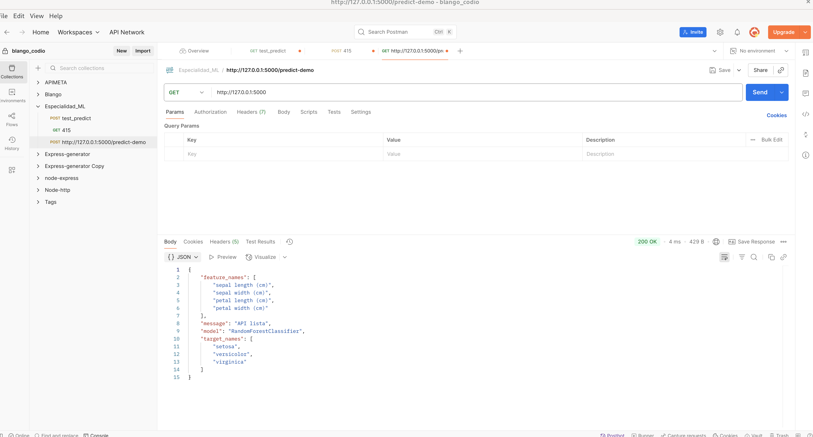
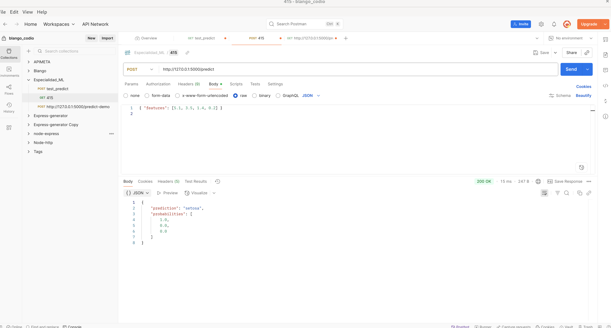
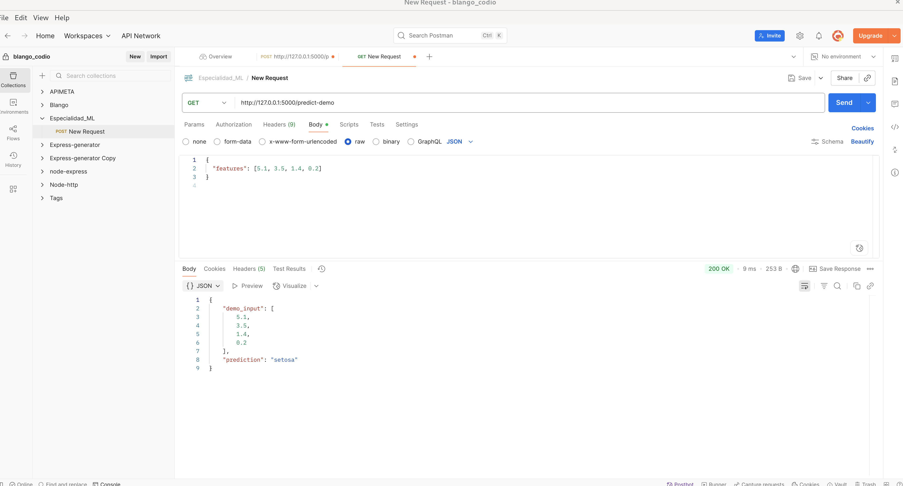
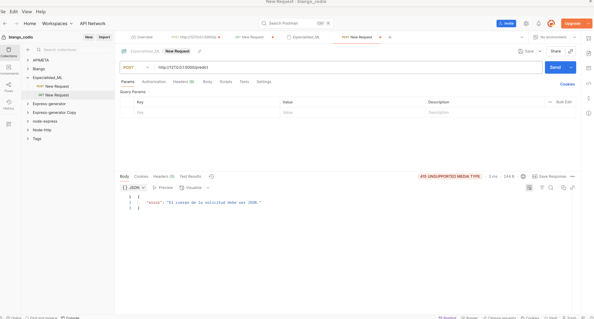
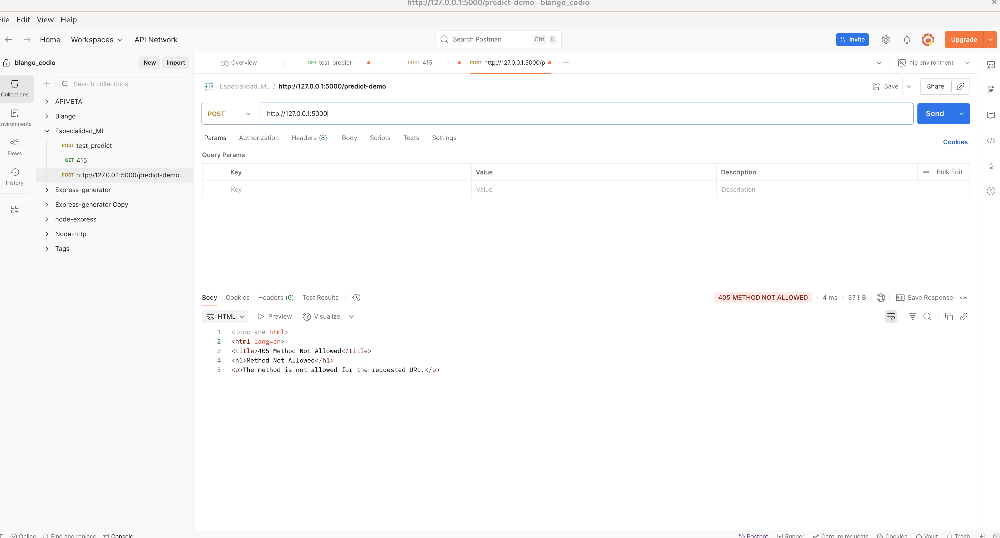

# Módulo 10 — Sesión 1

## Despliegue básico de un modelo de Machine Learning con Flask (API REST)

Este proyecto implementa una **API REST con Flask** que expone un **modelo de clasificación** (Iris) entrenado con técnicas de Machine Learning. Incluye validación de entradas, manejo de errores y un script de pruebas.

---

## Estructura de carpetas

```
flask_ml_api/
├─ environment.yml
├─ README.md
├─ app.py
├─ src/
│  └─ train_model.py
│  └─ test_api.py
└─ models/
   └─ modelo.pkl   # (generado por train_model)
```

> **Nota:** `modelo.pkl` se genera luego de entrenar el modelo con `python -m src.train_model`.

---

## 1) Crear y activar entorno con Conda

```
conda env create -f environment.yml
conda activate flask-ml-api
```

---

## 2) Entrenar el modelo

Ejecuta el script de entrenamiento para generar el artefacto en `models/modelo.pkl`.

```
python -m src.train_model
```

---

## 3) Ejecutar la API Flask

```
python -m app
```

La API estará disponible en:

```
http://127.0.0.1:5000/
```

---

## 4) Probar la API

Prueba los endpoints con herramientas como **curl** o ejecutando el script de test.

### Con curl (ejemplos de uso):

```
curl -X GET http://127.0.0.1:5000/

curl -s -X POST http://127.0.0.1:5000/predict \
  -H "Content-Type: application/json" \
  -d '{"features":[5.1,3.5,1.4,0.2]}'

```

### Con script de pruebas:

```
python -m src.test_api
```

---

## 5) Generar entrega

Empaqueta todos los archivos requeridos en un zip:

```
cd flask_ml_api
zip -r entrega_flask_ml_api.zip .
```

---

## Notas

* Modelo entrenado: RandomForestClassifier sobre Iris (puede cambiarse en `train_model`).
* Validación estricta: `features` debe ser una lista numérica con la cantidad correcta de atributos.
* Respuesta: JSON con clase predicha y, si corresponde, probabilidades.


## Resultados

### Métricas del modelo
El modelo RandomForestClassifier entrenado sobre el dataset Iris obtuvo los siguientes resultados en el conjunto de prueba:

- **Accuracy:** 0.90  
- **Reporte de clasificación:**

| Clase      | Precisión | Recall | F1-score | Soporte |
|------------|-----------|--------|----------|---------|
| 0 (setosa) | 1.00      | 1.00   | 1.00     | 10      |
| 1 (versicolor) | 0.82  | 0.90   | 0.86     | 10      |
| 2 (virginica) | 0.89   | 0.80   | 0.84     | 10      |
| **Accuracy**   |       |        | **0.90** | 30      |
| **Macro avg**  | 0.90  | 0.90   | 0.90     | 30      |
| **Weighted avg** | 0.90 | 0.90  | 0.90     | 30      |

---

### Resultados en Postman

#### 1. GET `/` (estado de la API)


#### 2. POST `/predict` (predicción exitosa – 200 OK)


#### 3. GET `/predict-demo` (predicción de ejemplo – 200 OK)


#### 4. POST `/predict` con Content-Type incorrecto (415 Unsupported Media Type)


#### 5. POST en endpoint que solo permite GET (405 Method Not Allowed)



## Evidencia de pruebas con `src.test_api`

Se ejecutó el script de prueba con:

```bash
python -m src.test_api
````

### Salida en terminal

```
GET / → status: 200
{
  "feature_names": [
    "sepal length (cm)",
    "sepal width (cm)",
    "petal length (cm)",
    "petal width (cm)"
  ],
  "message": "API lista",
  "model": "RandomForestClassifier",
  "target_names": [
    "setosa",
    "versicolor",
    "virginica"
  ]
}

POST /predict #1
status: 200
{
  "prediction": "setosa",
  "probabilities": [
    1.0,
    0.0,
    0.0
  ]
}

POST /predict #2
status: 200
{
  "prediction": "versicolor",
  "probabilities": [
    0.0,
    0.99,
    0.01
  ]
}

POST /predict #3
status: 400
{
  "error": "'features' debe tener exactamente 4 valores para Iris."
}
```


