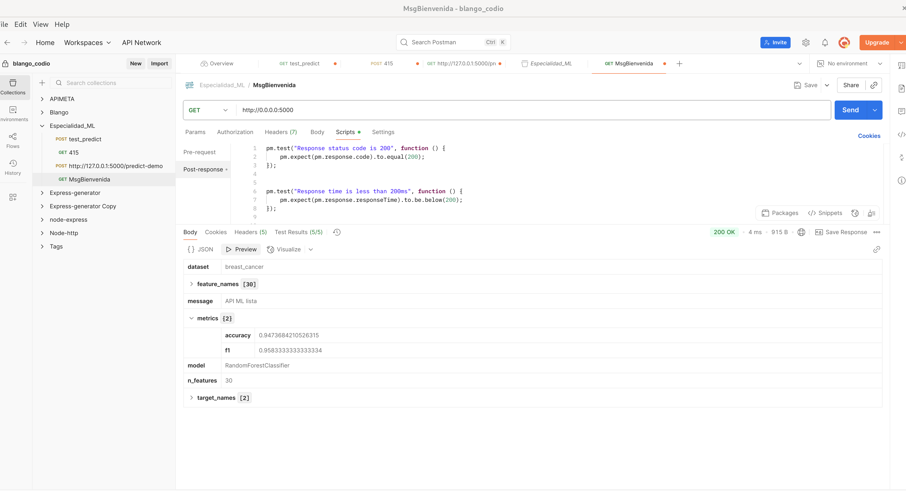
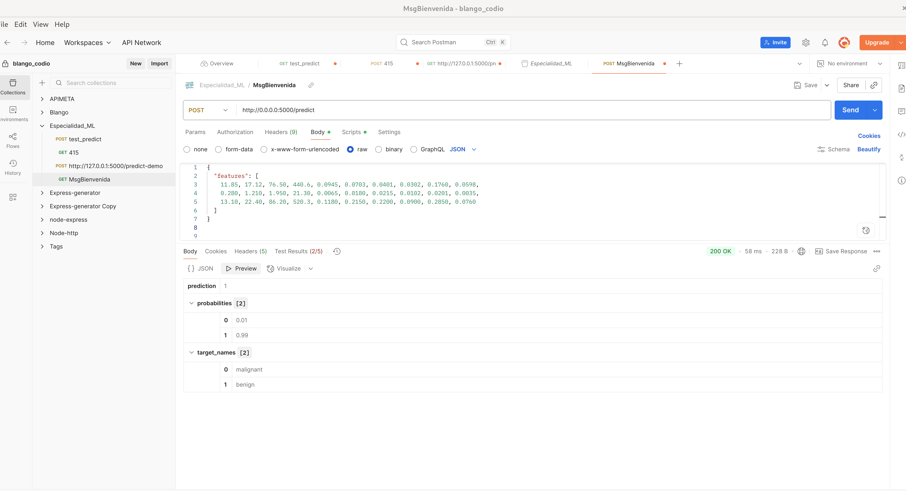
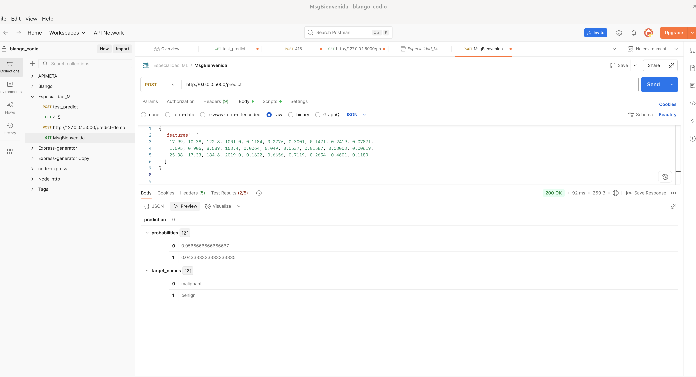
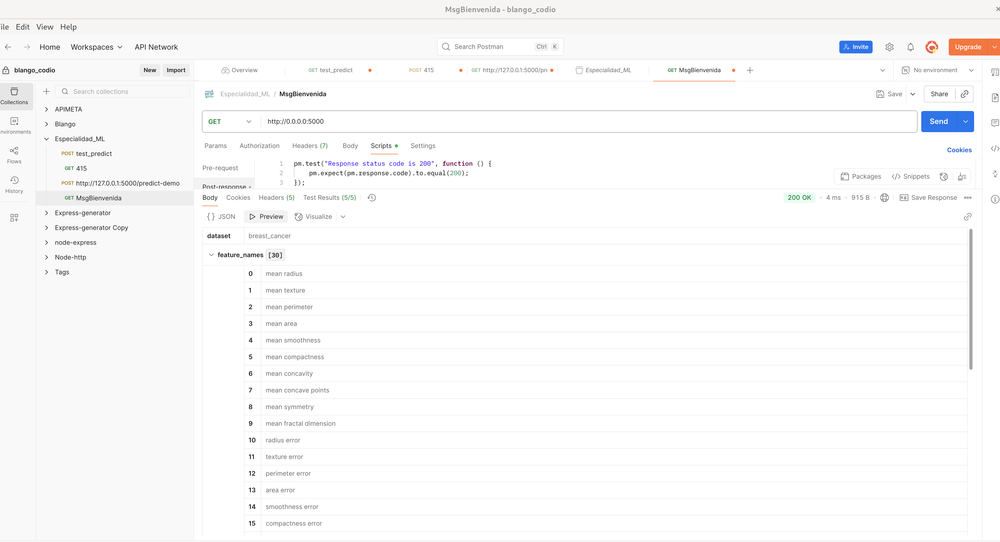
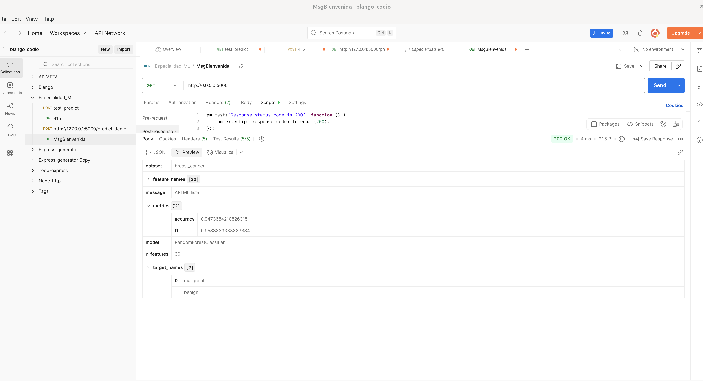
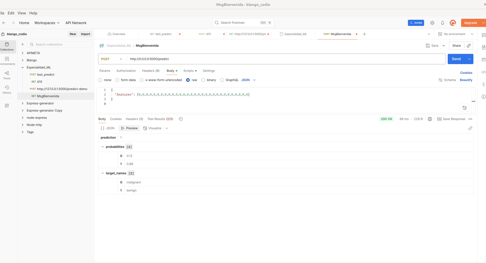
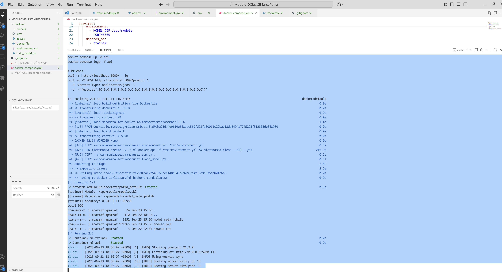

# 🐳 Contenerización de una API de Machine Learning con Docker + Mamba Conda

## 📌 Resumen Ejecutivo
Este proyecto demuestra cómo entrenar y desplegar un modelo de Machine Learning en un entorno **contenedorizado con Docker**, utilizando **Conda (micromamba)** para la gestión de dependencias.  
El objetivo fue encapsular todo el flujo en servicios reproducibles y portables:  
- **trainer**: entrena un modelo de clasificación sobre el dataset *Breast Cancer* de `scikit-learn`.  
- **api**: expone una API REST con Flask y Gunicorn que permite realizar inferencias sobre nuevas muestras.  

La solución integra:
- **Docker Compose** para orquestar múltiples servicios y volúmenes.  
- **Micromamba/Conda** para crear entornos ligeros y reproducibles.  
- **Persistencia de artefactos** (modelos entrenados) mediante volúmenes.  
- **Pruebas de endpoints** con Postman.  

---

## 🎯 Objetivos Tecnológicos
1. Implementar un flujo completo de entrenamiento e inferencia dentro de contenedores.  
2. Utilizar **Conda/micromamba** para gestionar dependencias científicas de ML.  
3. Asegurar la **persistencia del modelo** en un volumen (`backend/models`).  
4. Probar la API mediante **Postman** para garantizar su accesibilidad desde cualquier cliente.  
5. Documentar la estructura y funcionamiento de los servicios con un enfoque reproducible y portable.  

---

## 📂 Estructura del Proyecto

```bash
.
├── backend/
│   ├── app.py                  # API Flask (endpoints / y /predict)
│   ├── train_model.py          # Entrenamiento del modelo
│   ├── environment.yml         # Dependencias Conda
│   ├── Dockerfile              # Imagen base (micromamba)
│   ├── models/                 # Artefactos entrenados (persisten en volumen)
│   └── static/images/          # Evidencias de Postman y logs
├── docker-compose.yml          # Orquestación de servicios
├── README.md                   # Este documento
````

---

## ⚙️ Instalación y Ejecución

### 1️⃣ Construir la imagen base

```bash
docker build -t ml-backend-conda:latest ./backend --no-cache
```

### 2️⃣ Entrenar el modelo (servicio `trainer`)

```bash
docker compose run --rm trainer
```

Esto genera los artefactos en `backend/models/`:

* `modelo.pkl`
* `model_meta.joblib`

### 3️⃣ Levantar la API

```bash
docker compose up -d api
docker compose logs -f api
```

### 4️⃣ Probar endpoints

Con `curl`:

```bash
curl -s http://localhost:5000/ | jq
```

Con **Postman**: importar las colecciones y enviar peticiones `GET` y `POST`.

---

## 📡 Funcionamiento del Docker Compose

* **Servicios**:

  * `trainer`: ejecuta `train_model.py` dentro del contenedor, guardando los artefactos en el volumen `models`.
  * `api`: expone el modelo vía Flask+Gunicorn, leyendo los artefactos previamente generados.
* **Volúmenes**:

  * `backend/models` se monta en `/app/models` para persistir modelos entre ejecuciones.
* **Red interna**:

  * Ambos servicios corren en la red `modulo10clase2marcoparra_default`.

---


## 📌 Uso de Postman

* **GET /** → devuelve información del modelo cargado (dataset, métricas, features).
* **POST /predict** → recibe un JSON con 30 features y devuelve:

  * `prediction`: clase predicha.
  * `probabilities`: distribución de probabilidad.
  * `target_names`: etiquetas (`malignant`, `benign`).

Ejemplo:

```json
{
  "features": [12.45, 15.70, 82.57, 477.1, 0.1278, 0.1700, ... 0.3985, 0.1244]
}
```

---

## 📂 `.dockerignore`

```dockerignore
# Ignorar datasets y modelos locales
data/
models/
backend/models/

# Ignorar imágenes y evidencias
*.png
*.jpg
*.jpeg
*.gif
*.pdf

# Archivos temporales
__pycache__/
*.pyc
*.pyo
*.pyd

# Archivos de entorno
.env
*.conda
*.ipynb_checkpoints/

# Archivos de IDEs/editores
.vscode/
.idea/
*.swp

# Git y sistema
.git
.gitignore
.dockerignore
.DS_Store
Thumbs.db
```

---


## 📊 Resultados del Entrenamiento

El modelo final es un **RandomForestClassifier**, entrenado sobre el dataset *Breast Cancer*.

| Métrica  | Valor |
| -------- | ----- |
| Accuracy | 0.947 |
| F1-Score | 0.958 |

Artefactos generados en `backend/models/`:

* ✅ `modelo.pkl`
* ✅ `model_meta.joblib`

---

## 🧪 Resultados de Inferencia (Postman)

### 🔹 GET `/`

Devuelve metadatos del modelo cargado:



---

### 🔹 POST `/predict` (Ejemplo benign)

```json
{
  "features": [
    11.85, 17.12, 76.50, 440.6, 0.0945, 0.0703, 0.0401, 0.0382, 0.1760, 0.0598,
    0.280, 1.210, 1.590, 21.30, 0.0065, 0.0180, 0.0215, 0.0182, 0.0201, 0.0035,
    13.10, 22.40, 86.20, 520.3, 0.1180, 0.2150, 0.2200, 0.0990, 0.2850, 0.0760
  ]
}
```

**Respuesta esperada:**

```json
{
  "prediction": 1,
  "probabilities": [0.01, 0.99],
  "target_names": ["malignant", "benign"]
}
```

📷 Evidencia:


---

### 🔹 POST `/predict` (Ejemplo malignant)

```json
{
  "features": [
    17.99, 10.38, 122.8, 1001.0, 0.1184, 0.2776, 0.3001, 0.1471, 0.2419, 0.07871,
    1.095, 0.905, 8.589, 153.4, 0.0064, 0.049, 0.0537, 0.01857, 0.03003, 0.00619,
    25.38, 17.33, 184.6, 2019.0, 0.1622, 0.6656, 0.7119, 0.2654, 0.4601, 0.1189
  ]
}
```

**Respuesta esperada:**

```json
{
  "prediction": 0,
  "probabilities": [0.96, 0.04],
  "target_names": ["malignant", "benign"]
}
```

📷 Evidencia:


---

## 📘 Explicación de Postman

Postman se utilizó para:

1. **Enviar requests HTTP** a la API (`GET /`, `POST /predict`).
2. **Probar diferentes payloads JSON** con vectores de 30 características.
3. **Visualizar las respuestas estructuradas** (predicción, probabilidades, nombres de clases).

Esto valida que el API funciona de forma portable, sin importar el cliente (Postman, curl, navegador, etc.).

---

## ✅ Conclusión

Este proyecto muestra un flujo completo de:

* Entrenamiento y despliegue de un modelo ML.
* Contenerización con Docker + micromamba.
* Orquestación de servicios con Docker Compose.
* Inferencia reproducible y portable probada con Postman.

De esta manera, se garantiza un **entorno controlado, replicable y listo para despliegue en cualquier infraestructura**.


---

## 📊 Anexos

### 🔹 Evidencias de Postman (endpoints)

#### GET `/`


#### GET `/` – sección de features



#### GET `/` – métricas



---

### 🔹 Predicciones con POST `/predict`

#### Ejemplo 1 – Benigno


#### Ejemplo 2 – Maligno


#### Ejemplo 3 – Otro caso (todos cero)



#### Ejemplo 4 – Run server




---

