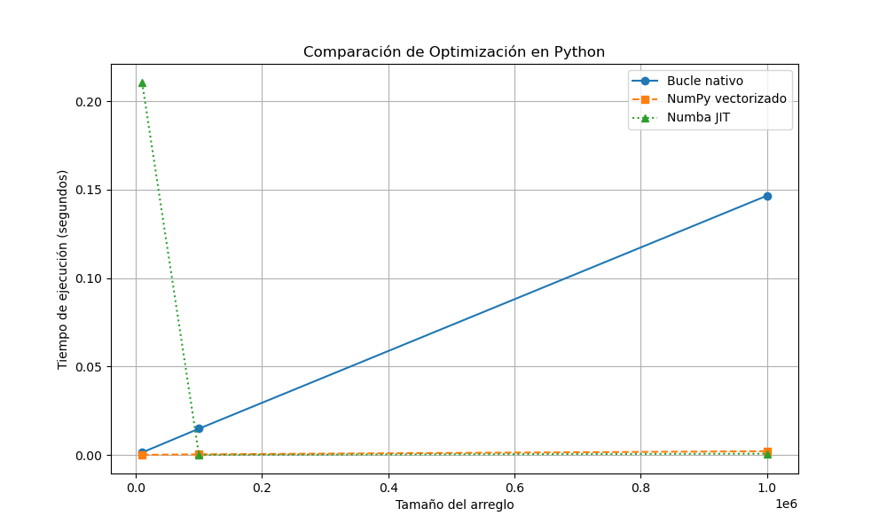

## 🧠 Informe: Optimización de Código en Python

### 🎯 Objetivo

Comparar el rendimiento de tres implementaciones de una operación intensiva (suma de productos entre vectores):

* ✅ Bucle nativo (`for`)
* ✅ Operación vectorizada con NumPy
* ✅ Optimización con Numba (`@jit`)

---

## 📊 Resultados (2da ejecución)

| Tamaño    | Bucle Nativo (s) | NumPy Vectorizado (s) | Numba JIT (s) |
| --------- | ---------------- | --------------------- | ------------- |
| 10.000    | 0.00142          | 0.000076              | 0.21065 ⏱️    |
| 100.000   | 0.01488          | 0.00038               | 0.000089 ✅    |
| 1.000.000 | 0.14664          | 0.00214               | 0.000766 ✅    |
Basado en los archivos JSON generados, aquí un análisis comparativo en formato **Markdown** con gráficos y resultados.

### 📌 Observaciones

* ⚠️ En **el primer llamado de Numba**, el tiempo es alto (`~0.21 s`) por la **compilación JIT inicial**.
* En llamadas posteriores, **Numba es más rápido incluso que NumPy**.
* **NumPy vectorizado** se mantiene muy eficiente en todos los tamaños, especialmente útil para código corto y simple.
* **El bucle nativo escala linealmente y es el menos eficiente** a medida que crece el dataset.

---

### 📈 Gráfico de comparación

> El gráfico muestra claramente cómo **NumPy y Numba** superan al bucle nativo en eficiencia, con **Numba liderando en cargas pesadas**.

---

## ✅ Conclusión

* **NumPy vectorizado** es ideal para tareas matemáticas simples y concisas.
* **Numba JIT** brilla cuando se ejecutan múltiples veces o con funciones más complejas.
* El **bucle puro en Python no es recomendable** para cálculos intensivos a gran escala.
* La primera llamada con Numba siempre será más lenta por la compilación, pero las siguientes son extremadamente rápidas.

---

## 🗂️ Archivos generados

* `resultados_optimizacion_2da_ejecuion.json`
* `grafico_optimizacion_2da_ejecucion.png`
* `resultados_optimizacion_1era_ejecucion.json`
* `grafico_optimizacion_1era_ejecucion.png`

---

Primer llamado de Numba**, el tiempo es alto (`~0.21 s`) por la **compilación JIT inicial**.
* En llamadas posteriores, **Numba es más rápido incluso que NumPy**.
* **NumPy vectorizado** se mantiene muy eficiente en todos los tamaños, especialmente útil para código corto y simple.
* **El bucle nativo escala linealmente y es el menos eficiente** a medida que crece el dataset.

---

### 📈 Gráfico de comparación

> El gráfico muestra claramente cómo **NumPy y Numba** superan al bucle nativo en eficiencia, con **Numba liderando en cargas pesadas**.

---

## ✅ Conclusión

* **NumPy vectorizado** es ideal para tareas matemáticas simples y concisas.
* **Numba JIT** brilla cuando se ejecutan múltiples veces o con funciones más complejas.
* El **bucle puro en Python no es recomendable** para cálculos intensivos a gran escala.
* La primera llamada con Numba siempre será más lenta por la compilación, pero las siguientes son extremadamente rápidas.

---
