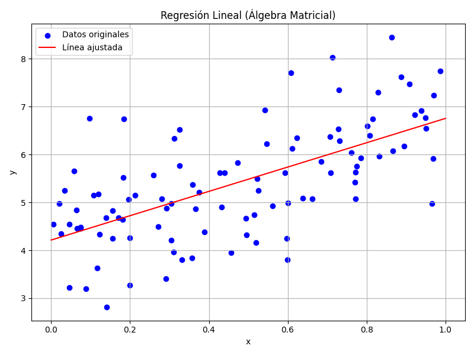

# 📊 Regresión Lineal con Álgebra Matricial

Este proyecto implementa una solución de regresión lineal simple en Python utilizando **álgebra matricial**. La implementación aplica directamente la fórmula matemática:

\[
\boldsymbol{\beta} = (X^T X)^{-1} X^T y
\]

donde:

- `X` es la **matriz de diseño** (columna de unos + columna de características)
- `y` es el **vector de valores observados**
- `β` es el **vector de parámetros estimados** (intercepto y pendiente)

---

## 🎯 Objetivo

Resolver la regresión lineal sin utilizar librerías de ML como `scikit-learn`, sino mediante manipulación de vectores y matrices con `NumPy`. Este enfoque permite:

- Comprender los fundamentos de muchos algoritmos de aprendizaje supervisado
- Visualizar paso a paso el ajuste de un modelo

---

## 🧠 Álgebra Matricial en Acción

### Dimensiones involucradas:

- `X.shape`: (100, 2) → 100 muestras, 2 columnas (bias + feature)
- `X.T.shape`: (2, 100)
- `X.T @ X.shape`: (2, 2)
- `β.shape`: (2, 1)

Estas formas confirman que la multiplicación matricial está correctamente definida, y que se obtiene un vector de dos parámetros: la ordenada al origen (**intercepto**) y la pendiente (**coeficiente de regresión**).

---

## 📈 Resultado Visual

El modelo ajustado genera una línea que minimiza el error cuadrático entre las predicciones y los valores reales, como se muestra en el siguiente gráfico:

---

## 📌 Estructura del Código

- `generar_datos(n=100)`  
  Genera 100 datos aleatorios con una relación lineal `y = 4 + 3x + ruido`.

- `ajustar_modelo(x, y)`  
  Aplica la fórmula matricial para estimar `β`.

- `graficar_resultado(x, y, beta)`  
  Dibuja los datos y la línea ajustada.

Cada función está documentada con docstrings, y el código contiene `print()` para mostrar las formas de las matrices involucradas, facilitando el análisis conceptual.

---

## 🧩 ¿Por qué es importante este enfoque?

La regresión lineal mediante álgebra matricial es la base de:

- Regresión múltiple
- Algoritmos de optimización (gradiente descendente)
- Redes neuronales (ajuste de pesos)
- Métodos estadísticos avanzados

Entender este proceso sin utilizar automatismos permite dominar los fundamentos matemáticos que sostienen modelos más complejos.

---

## ✅ Conclusión

Este proyecto demuestra cómo resolver una tarea fundamental de aprendizaje supervisado de manera explícita, clara y reproducible. Es ideal como ejercicio introductorio a Machine Learning desde una perspectiva matemática.

