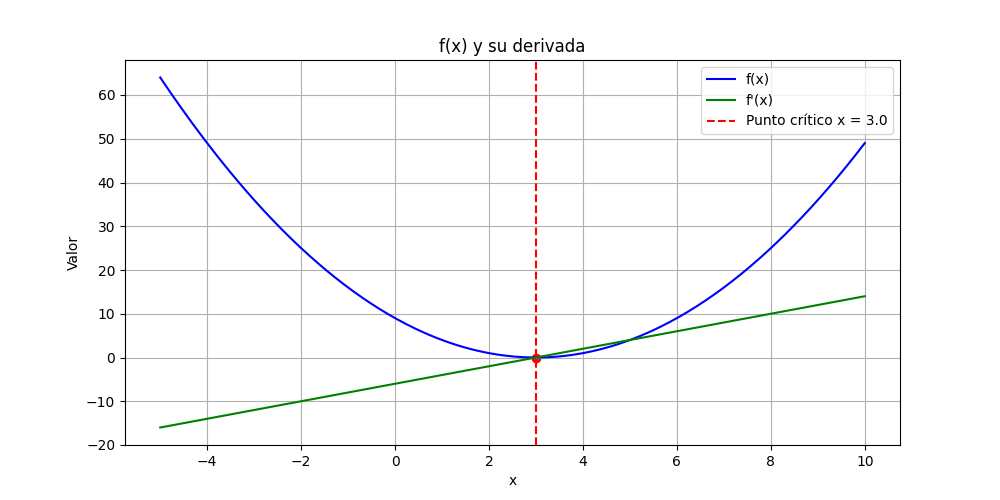

---

## 🔍 Descripción del Problema

Se analiza la función:
\[
f(x) = (x - 3)^2
\]

Pasos:
1. Derivación simbólica con `SymPy`  
2. Identifica---
ción del punto crítico resolviendo \( f'(x) = 0 \)  
3. Visualización con `Matplotlib`  
4. Optimización numérica con `SciPy.optimize.minimize`

---

## ✅ Resultados Obtenidos

- **Punto crítico simbólico:** \( x = 3 \)
- **Mínimo numérico con SciPy:** \( x = 3.0000 \), \( f(x) = 0.0000 \)
- **Validación:** Resultados coinciden perfectamente

---

## 📈 Evidencias

- Gráfico generado: `outputs/funcion_derivada.png`  
  Muestra claramente el mínimo en \( x = 3 \)



---

## 💡 Relevancia para Machine Learning

Comprender derivadas, mínimos y optimización es **fundamental** para:
- Entrenamiento de modelos (descenso del gradiente)
- Ajuste de funciones de costo
- Análisis de comportamiento de funciones no lineales

Este proyecto sienta las bases para entender cómo los algoritmos de ML optimizan funciones durante el aprendizaje.

---

## 🚀 Requisitos

- `SymPy`
- `Matplotlib`
- `NumPy`
- `SciPy`

Instalable con:
```bash
pip install sympy matplotlib numpy scipy
