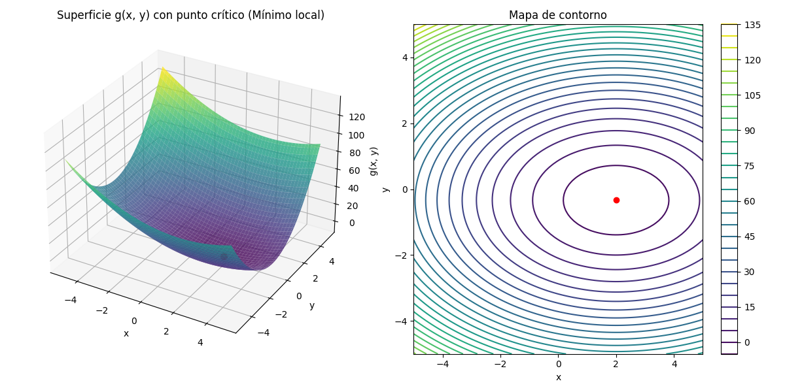

# Optimización y Análisis Geométrico de Funciones en Dos Variables

Este proyecto implementa el análisis simbólico, visual y numérico de una función g(x, y) con dos variables.
Se calcula el gradiente, la matriz Hessiana y se visualizan los puntos críticos. También se discute la relación
con técnicas de optimización utilizadas en Machine Learning.

Este proyecto aplica cálculo diferencial multivariable con el objetivo de identificar y clasificar puntos críticos en funciones de dos variables. Se realiza un análisis simbólico con SymPy, visualizaciones 3D con Matplotlib y se complementa con un enfoque aplicado al contexto del **descenso por gradiente** en Machine Learning.

---

## 🎯 Objetivo

- Calcular derivadas parciales, gradiente y matriz Hessiana de una función 𝑔(𝑥, 𝑦).
- Resolver el sistema ∇g(x, y) = (0, 0) para encontrar puntos críticos.
- Clasificar dichos puntos usando los valores propios de la Hessiana.
- Visualizar la superficie 3D y su mapa de contorno.
- Discutir su relevancia en optimización de modelos.

---

## 🧠 Función Analizada

```python
g(x, y) = x² - 4x + 3y² + 2y + 1
```

* Punto crítico encontrado: **(x = 2, y = -1/3)**
* Clasificación: **Mínimo local**
* Confirmado por valores propios positivos de la Hessiana: λ₁ = 2, λ₂ = 6
* Resultado gráfico: superficie convexa, con el mínimo destacado en rojo.


## 📁 Estructura del Proyecto

```
Modulo3Clase4/
├── src/
│   ├── funciones.py           # Derivadas parciales, gradiente y Hessiana
│   ├── clasificador.py        # Clasifica puntos críticos según la Hessiana
│   └── visualizador.py        # Gráficos 3D y mapa de contorno
├── scripts/
│   └── main.py                # Flujo principal del análisis
├── notebook/
│   └── analisis_2d.ipynb      # Versión interactiva en Jupyter
├── outputs/
│   └── grafico_3d.png         # Imagen generada con matplotlib
├── init_project.sh   ---      # Script de entorno e instalación Conda
├── environment.yml            # Definición del entorno Conda
└── README.md
```

---

## ⚙️ Requisitos y Entorno

Instala Conda (Miniconda o Anaconda) y ejecuta el entorno:

```bash
conda env create -f environment.yml
conda activate especialidadmachinelearning
```

---

## 🚀 Uso

### ▶️ Ejecutar análisis completo (versión script)

```bash
python scripts/main.py
```

### 📓 Versión interactiva (Jupyter Notebook)

```bash
jupyter notebook notebook/main.ipynb
```

### ⚡ Iniciar proyecto automáticamente

```bash
chmod +x init_project.sh
./init_project.sh

```


Este script crea el entorno Conda, instala dependencias y lanza Jupyter.

---

## 🧠 Relevancia en Machine Learning

La identificación de puntos críticos y clasificación de la curvatura mediante valores propios de la Hessiana es clave en:

* **Descenso por gradiente**: busca mínimos locales/globales.
* **Análisis de superficies de error**: evaluación de convergencia.
* **Entrenamiento de redes neuronales**: evitando puntos de silla o malos mínimos.

---

## 📷 Evidencia Gráfica

| Superficie 3D                      | Mapa de Contorno                   |
| ---------------------------------- | ---------------------------------- |
|  |  |

---

## 📌 Autor

Proyecto desarrollado como parte del módulo "Optimización y Funciones Multivariables" — Especialidad Machine Learning.


Aquí tienes una propuesta para **agregar al final del `README.md`** una sección de **análisis de resultados**, que incluye tanto el resumen simbólico como la interpretación visual:

---

## 📈 Resultados del Análisis

Al ejecutar `python scripts/main.py`, se obtuvo el siguiente desarrollo simbólico:

```text
Definiendo la función g(x, y): x**2 - 4*x + 3*y**2 + 2*y + 1
Definiendo las variables simbólicas: x = x, y = y
🔍 Gradiente calculado: Matrix([[2*x - 4], [6*y + 2]])
🔍 Hessiana calculada: Matrix([[2, 0], [0, 6]])
🔍 Puntos críticos encontrados: [{x: 2, y: -1/3}]
Evaluando la Hessiana en el punto crítico: {x: 2, y: -1/3}
Valores propios de la Hessiana: {2: 1, 6: 1}
Valores propios extraídos: [2, 6]

✅ Punto crítico encontrado: {x: 2, y: -1/3}
🔍 Tipo de punto: Mínimo local
```

El análisis simbólico y numérico permitió identificar un **único punto crítico** en $x = 2, y = -\frac{1}{3}$. La evaluación de la matriz Hessiana en dicho punto arrojó **valores propios positivos** ($\lambda_1 = 2, \lambda_2 = 6$), lo que confirma que se trata de un **mínimo local**.

### 📊 Visualización del resultado

El siguiente gráfico representa la función $g(x, y)$ como superficie tridimensional junto con su **mapa de contorno**. El **punto crítico** se marca en rojo y corresponde al mínimo local encontrado:

<p align="center">
  
</p>


---


