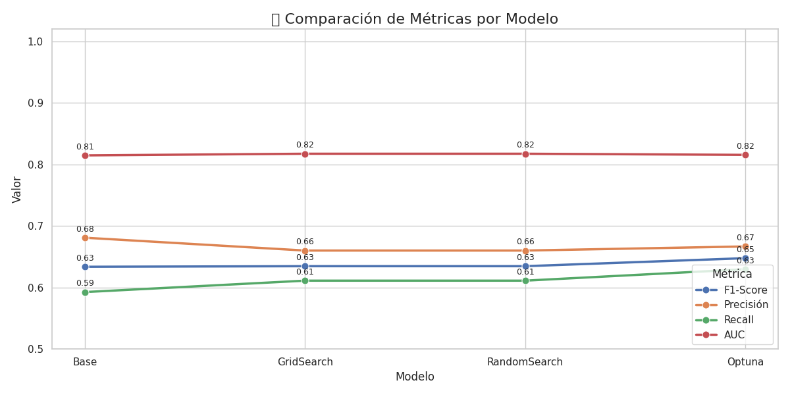
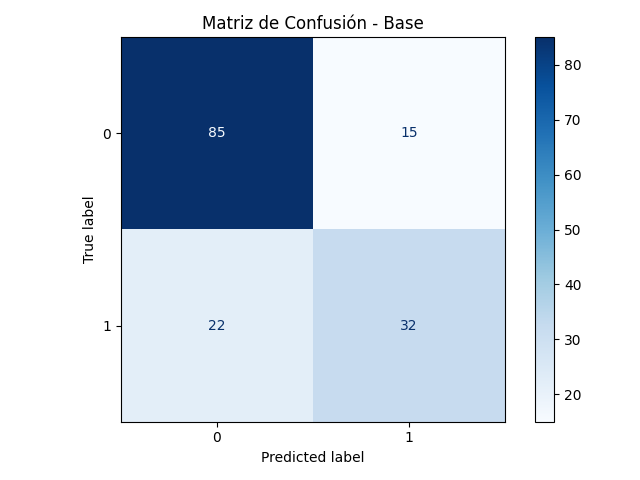
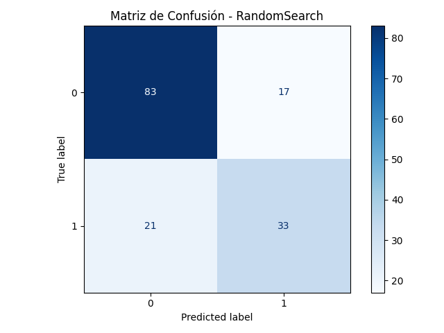
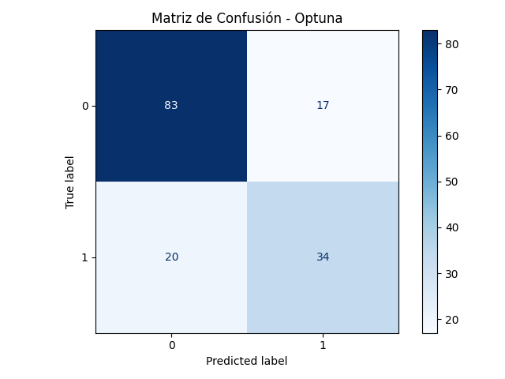
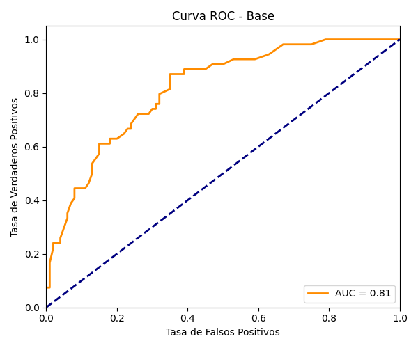
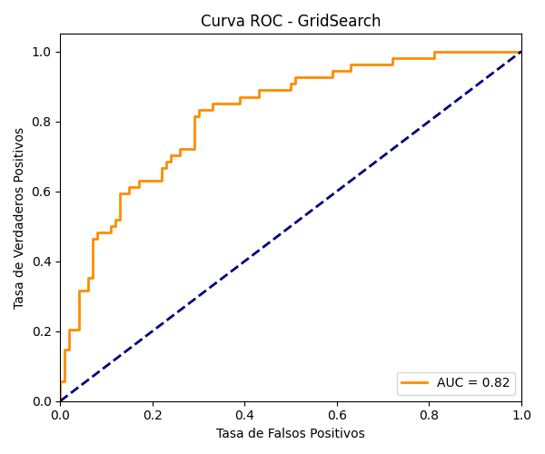
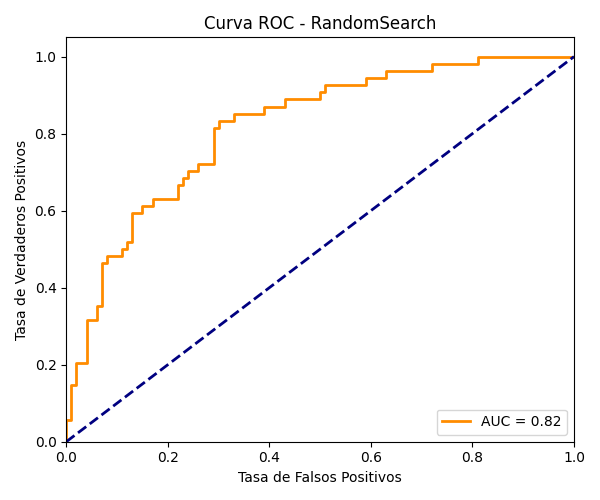
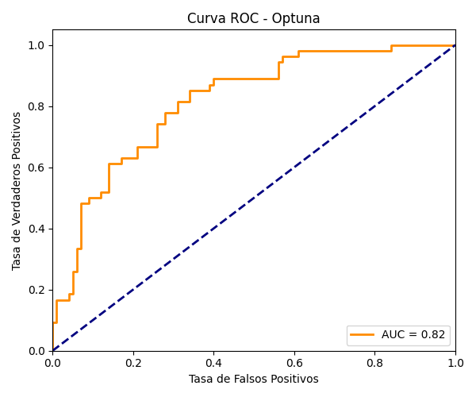

# 🧪 Clasificación de Diabetes con Optimización de Hiperparámetros

Este proyecto tiene como objetivo aplicar distintas técnicas de optimización de hiperparámetros a un modelo de clasificación de diabetes utilizando Random Forest. Se comparan las siguientes técnicas:

- Entrenamiento base sin optimización.
- Grid Search
- Random Search
- Optuna

## 📦 Instalación

Puedes ejecutar el proyecto con `pip` (sin necesidad de instalar `conda`):

```bash
conda env create --file environment.yml
conda activate especialidadmachinelearning
````


```bash
pip install pandas numpy matplotlib seaborn scikit-learn optuna
```

## ▶️ Ejecución

Desde el directorio raíz del proyecto, puedes correr el pipeline completo desde consola con:

```bash
python -m scripts.main
```

O bien, puedes generar y ejecutar el notebook automáticamente:

```bash
python -m scripts.crear_notebook
```

Esto generará un archivo `notebooks/clasificacion_diabetes.ipynb` con todo el flujo visual.

---

## 🗂️ Estructura del Proyecto

```
Modulo4Clase1MarcoParra/
│
├── src/
│   ├── utils.py               # Preprocesamiento y entrenamiento base
│   ├── optimizacion.py        # GridSearch, RandomSearch, Optuna
│   ├── visualizador.py        # Funciones de visualización
│
├── scripts/
│   ├── main.py                # Script principal
│   ├── crear_notebook.py      # Generador automático de notebook
│
├── notebooks/
│   └── clasificacion_diabetes.ipynb
│
├── outputs/
│   ├── comparacion_metricas_modelos.png
│   ├── roc_base.png
│   ├── matriz_confusion_base.png
│   └── ...
```

---

## 📊 Análisis de Resultados

Se evaluaron las métricas F1-Score, Precisión, Recall y AUC para cada técnica de entrenamiento.

### 📈 Comparación de métricas por modelo



> Podemos observar que los valores son similares, aunque Optuna logra una mejora leve en Recall respecto al modelo base.

---

### 📌 Matrices de Confusión

| Método       | Matriz de Confusión                                  |
| ------------ | ---------------------------------------------------- |
| Base         |            |
| GridSearch   |      |
| RandomSearch |  |
| Optuna       |        |

---

### 📌 Curvas ROC

| Método       | Curva ROC                               |
| ------------ | --------------------------------------- |
| Base         |            |
| GridSearch   |      |
| RandomSearch |  |
| Optuna       |        |

> El AUC permanece estable (\~0.82) en todos los métodos, demostrando buena capacidad de discriminación.

---

## 🚀 Tecnologías Utilizadas

* Python 3.8
* Scikit-learn
* Optuna
* Matplotlib
* Seaborn
* Pandas / Numpy

---

## 📌 Conclusión

Aunque los métodos de optimización no generan diferencias drásticas en el rendimiento, permiten explorar automáticamente el espacio de hiperparámetros y detectar combinaciones óptimas. Optuna, en particular, destaca por su eficiencia y facilidad de integración.

---

