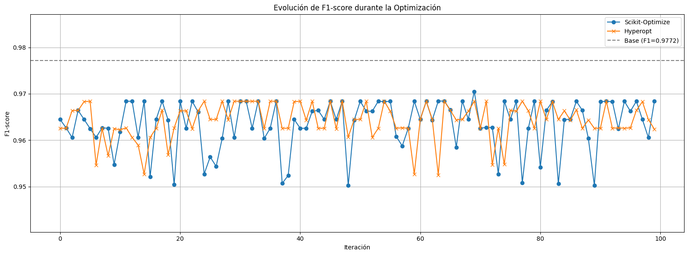
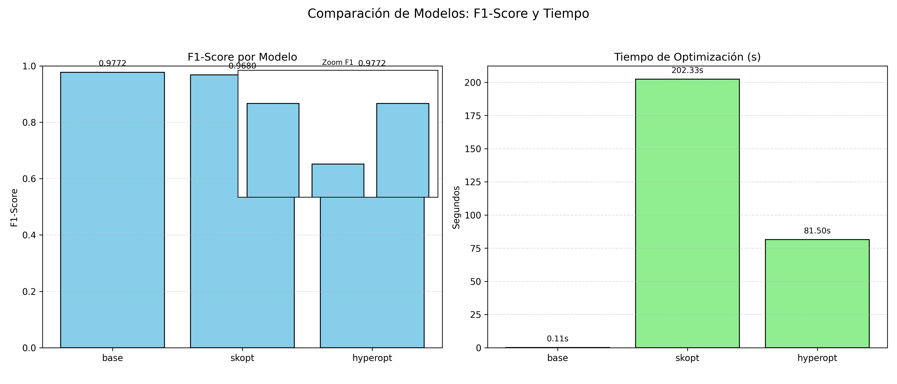

# 🧠 Optimización Bayesiana de Modelos de Clasificación

Este proyecto aplica técnicas de optimización bayesiana (`Scikit-Optimize` y `Hyperopt`) para mejorar el rendimiento de un modelo `RandomForestClassifier` en la detección de cáncer de mama, utilizando el dataset incluido en `sklearn.datasets`.

## 🚀 Tecnologías Utilizadas

- **Python 3.8**
- **scikit-learn**: para modelado, métricas y procesamiento
- **scikit-optimize**: optimización bayesiana con `BayesSearchCV`
- **Hyperopt**: optimización bayesiana con búsqueda en espacio continuo
- **matplotlib / seaborn**: visualización de resultados
- **numpy / pandas**: manipulación de datos

## 📦 Instalación

Requiere conda y Python 3.8. Clona el repositorio y ejecuta:

```bash
conda env create -f environment.yml
conda activate especialidadmachinelearning
````

> Asegúrate de que tu entorno se llame `especialidadmachinelearning` o edita el `sh` de creación.

## ▶️ Ejecución

Desde la raíz del proyecto, ejecuta:

```bash
python -m scripts.main
```

Los resultados y gráficos serán guardados automáticamente en la carpeta `outputs/`.

## 📊 Análisis de Resultados

Se compararon tres enfoques:

* 🎯 **Modelo Base**: `RandomForestClassifier` sin optimización.
* 🔍 **Scikit-Optimize**: optimización bayesiana sobre hiperparámetros.
* 🔎 **Hyperopt**: búsqueda bayesiana con TPE.

### Comparación de F1-Score y Tiempo



> Se incluye un zoom en el F1-Score (subgráfico) debido a las diferencias sutiles entre métodos.

### Evolución del F1-Score



> La línea punteada indica el rendimiento del modelo base. Se observa que, aunque los optimizadores exploran el espacio, el modelo base supera levemente a las configuraciones encontradas en tiempo considerablemente menor.

### Conclusiones

* El modelo base con hiperparámetros por defecto obtuvo el **mejor F1-Score (0.9772)**.
* Las optimizaciones exploraron un gran número de combinaciones, pero **no superaron al modelo base**.
* En términos de tiempo, el modelo base es **claramente superior**, útil cuando se busca una solución rápida y efectiva.
* Sin embargo, la optimización sigue siendo valiosa en escenarios donde el modelo base no rinde bien o se busca robustez generalizada.

## 📁 Estructura del Proyecto

```
├── scripts/
│   └── main.py                # Script principal
├── src/
│   ├── utils.py               # Carga de datos y optimización
│   └── visualizador.py        # Gráficas y visualización
├── outputs/
│   ├── comparacion_resultados.png
│   └── evolucion_f1_score.png
├── environment.yml            # Entorno Conda reproducible
└── README.md
```

## 📚 Referencias

* [scikit-learn](https://scikit-learn.org/)
* [scikit-optimize](https://scikit-optimize.github.io/)
* [Hyperopt](http://hyperopt.github.io/hyperopt/)

---

🔬 *Desarrollado como parte del curso de Especialidad en Machine Learning, Módulo 4 - Optimización de Modelos.*

