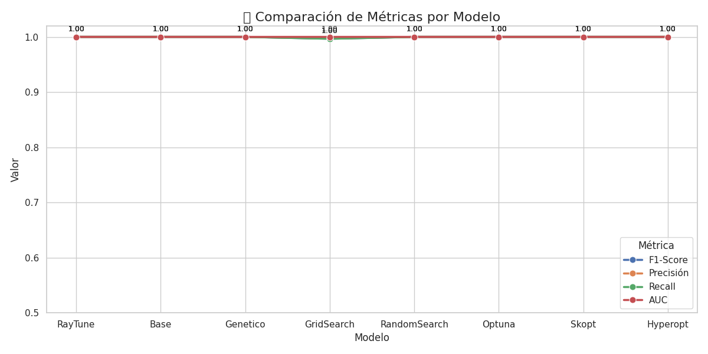
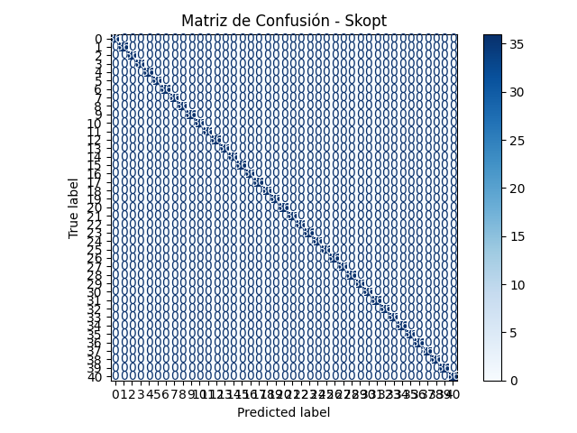
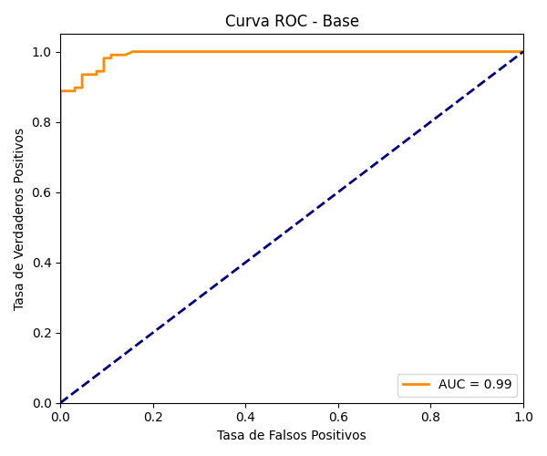
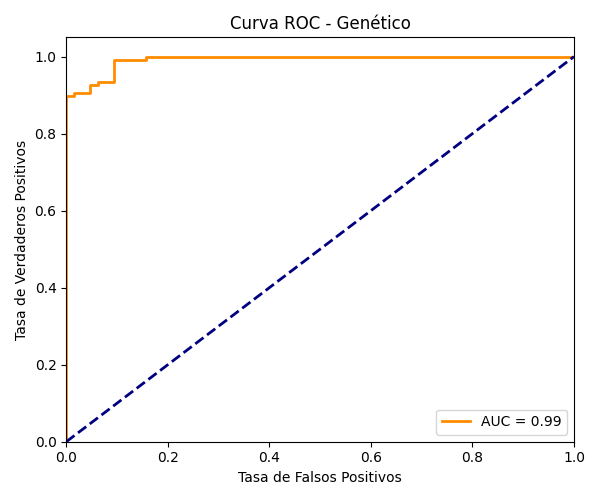

# 🧪 Comparación de Técnicas de Optimización de Hiperparámetros

Este proyecto explora diferentes enfoques de optimización de hiperparámetros para modelos de clasificación multiclase usando `RandomForestClassifier`. Se evaluaron varios algoritmos de optimización y se compararon sus rendimientos utilizando métricas estándar como F1-Score, Precisión, Recall y AUC, así como visualizaciones como curvas ROC y matrices de confusión.

---

## 📁 Directorios de salida

### `outputs/` – **Enfoque con `Training.csv`**

Este enfoque utilizó solamente el archivo `Training.csv` tanto para entrenar como para evaluar los modelos. Sin embargo, debido al sobreajuste (overfitting), todos los modelos obtenían un F1-score y AUC perfectos de 1.0, por lo que **no es confiable para evaluar la generalización del modelo**.

**Archivos incluidos:**

* `comparacion_metricas_modelos.png`: Comparación visual de métricas.
* `matriz_confusion_*.png`: Matrices de confusión por modelo.
* `roc_*.png`: Curvas ROC por modelo.

📊 Ejemplos

* 
* 
* 

---

### `outputs_cv/` – **Enfoque con Validación Cruzada**

Se implementó un segundo enfoque más robusto utilizando validación cruzada (`cross-validation`). Esta estrategia permite estimar el rendimiento real del modelo sobre datos no vistos. Aunque el rendimiento es más realista, **solo se pudo ejecutar correctamente como script Python localmente**. No fue posible correr Ray Tune en notebooks Jupyter por errores relacionados con `ModuleNotFoundError: No module named 'src'`.

**Archivos incluidos:**

* `outputs_cv/comparacion_metricas_modelos.png`
* `outputs_cv/matriz_confusion_base.png`
* `outputs_cv/matriz_confusion_raytune.png`

---

## ⚙️ Algoritmos evaluados

* `RayTune` (con Optuna y ASHAScheduler)
* `Genético`
* `GridSearch`
* `RandomSearch`
* `Optuna`
* `Skopt`
* `Hyperopt`
* `Base` (modelo sin optimización)

---

## 🔬 Métricas Comparadas

* **F1-Score**
* **Precisión**
* **Recall**
* **AUC (Área bajo la curva ROC)**

---

## 🧠 Conclusiones

* El uso exclusivo de `Training.csv` induce a un **sobreajuste extremo** (valores perfectos en entrenamiento).
* La validación cruzada entrega **una mejor aproximación al rendimiento real**.
* Algunos algoritmos como `RayTune` o `Optuna` son muy potentes pero requieren ejecución fuera de notebooks para funcionar correctamente.
* La comparación gráfica demuestra que **todos los modelos lograron un desempeño muy alto**, aunque se recomienda preferir los resultados de `outputs_cv`.

---
# 🔍 Comparación de Modelos con y sin Validación Cruzada

Este proyecto explora distintas técnicas de optimización de hiperparámetros aplicadas a un modelo de clasificación multiclase, utilizando **Random Forest** como clasificador base. Se emplean múltiples estrategias de búsqueda y se comparan visualmente los resultados.

---

## 🧪 Enfoques Evaluados

### ✅ Enfoque 1: Sin Validación Cruzada (solo con `Training.csv`)

En este enfoque se entrena el modelo usando el archivo `Training.csv` y se evalúa sobre el mismo conjunto. **Este método genera overfitting**, con métricas artificialmente perfectas (F1 = 1.00, AUC = 1.00), lo que lo vuelve poco representativo para generalización real.

**Métricas y Visualizaciones:**

📊 Comparación general:
- `outputs/comparacion_metricas_modelos.png`

📌 Matrices de Confusión por modelo:
- `outputs/matriz_confusion_base.png`
- `outputs/matriz_confusion_raytune.png`
- `outputs/matriz_confusion_genético.png`
- `outputs/matriz_confusion_gridsearch.png`
- `outputs/matriz_confusion_randomsearch.png`
- `outputs/matriz_confusion_optuna.png`
- `outputs/matriz_confusion_skopt.png`
- `outputs/matriz_confusion_hyperopt.png`

📈 Curvas ROC:
- `outputs/roc_base.png`
- `outputs/roc_genético.png`
- `outputs/roc_gridsearch.png` *(otras no fueron generadas o se omitieron)*

---

### 🧪 Enfoque 2: Con Validación Cruzada (`cross_val_score`)

Este enfoque divide los datos de `Training.csv` en 5 folds usando validación cruzada. El objetivo es obtener métricas más robustas. Luego se evalúa el modelo final con `Testing.csv`.

📌 **Limitación importante**: Algoritmos como Ray Tune no funcionan correctamente en Jupyter Notebook (fallan por `ModuleNotFoundError: No module named 'src'`), por lo que **este pipeline se ejecutó únicamente como script Python local**.

**Métricas y Visualizaciones:**

📊 Comparación general:
- `outputs_cv/comparacion_metricas_modelos.png`

📌 Matrices de Confusión:
- `outputs_cv/matriz_confusion_base.png`
- `outputs_cv/matriz_confusion_raytune.png`

📈 *(Curvas ROC no generadas en este enfoque o no exportadas aún)*

---

## 📌 Comparación General

| Enfoque                      | Generaliza bien | Métricas realistas | Soporta Jupyter |
|-----------------------------|-----------------|---------------------|------------------|
| Sin Validación Cruzada      | ❌ No            | ❌ No (F1 = 1.0)     | ✅ Sí             |
| Con Validación Cruzada      | ✅ Sí            | ✅ Sí                | ⚠️ No (solo script local) |

---

## 📂 Archivos Generados

### `outputs/` (sin CV):
- `comparacion_metricas_modelos.png`
- `matriz_confusion_base.png`
- `matriz_confusion_raytune.png`
- `matriz_confusion_genético.png`
- `matriz_confusion_gridsearch.png`
- `matriz_confusion_randomsearch.png`
- `matriz_confusion_optuna.png`
- `matriz_confusion_skopt.png`
- `matriz_confusion_hyperopt.png`
- `roc_base.png`
- `roc_genético.png`
- `roc_gridsearch.png`

### `outputs_cv/` (con CV):
- `comparacion_metricas_modelos.png`
- `matriz_confusion_base.png`
- `matriz_confusion_raytune.png`

---

## 📌 Conclusión

- El uso de **validación cruzada** mejora la fidelidad de las métricas obtenidas.
- La evaluación sin validación cruzada **sobreestima el rendimiento** del modelo.
- Para entornos de producción o investigación, se recomienda **evitar el enfoque sin CV**.

---

# 📊 Comparación de Resultados: Modelos de Clasificación

Este repositorio contiene los resultados de múltiples métodos de optimización de hiperparámetros aplicados a un problema de clasificación multiclase con Random Forest.

Se evaluaron dos enfoques:

---

## ⚙️ Enfoque 1: Entrenamiento tradicional (solo `Training.csv`)

> Los modelos fueron entrenados y validados usando el conjunto de entrenamiento completo. Este método llevó a resultados con **F1 = 1.0**, indicando posible overfitting.

### 🔁 Comparación de Métricas

### 📉 Matrices de Confusión

- **RayTune**
  

- **Base**
  

- **Genético**
  

- **Grid Search**
  

- **Random Search**
  

- **Optuna**
  

- **Skopt**
  

- **Hyperopt**
  

### 📈 Curvas ROC

- **Base**
  

- **Genético**
  

- **Grid Search**
  

---

## ✅ Enfoque 2: Validación Cruzada (CV)

> En este enfoque se usó `cross_val_score` para evaluar robustez, reduciendo el riesgo de overfitting. Este método **solo funcionó desde Python nativo** (no en Jupyter).

### 🔁 Comparación de Métricas

### 📉 Matrices de Confusión

- **Base**
  

- **RayTune**
  

---

## 📝 Conclusiones

- El primer enfoque obtuvo métricas perfectas, pero probablemente sufre de overfitting al no validar con CV.
- El segundo enfoque con validación cruzada entrega resultados más fiables, aunque no se pudo ejecutar correctamente en Jupyter debido a incompatibilidades con Ray y `multiprocessing`.

---

## 📁 Directorios

- `outputs/`: resultados sin validación cruzada.
- `outputs_cv/`: resultados con validación cruzada.
- `notebooks/`: visualización automática generada en Jupyter.

---

