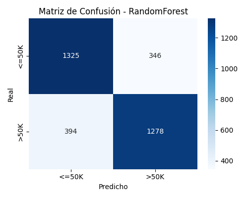
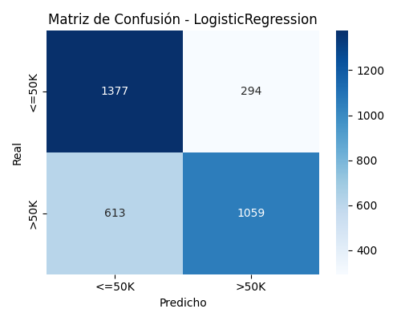

# 📌 Proyecto: Scoring Crediticio con Interpretabilidad

## 🎯 Objetivo
Construir un modelo predictivo para el scoring crediticio usando técnicas de regularización
(Lasso/Ridge) y aplicar interpretabilidad con **SHAP** y **LIME**.

## 📂 Estructura del Proyecto
```
├── data/                # Dataset raw y procesados
├── notebooks/           # Jupyter Notebooks
├── outputs/             # Gráficos, reportes y resultados
├── scripts/
│   ├── main.py          # Pipeline principal
│   └── crear_notebook.py # Generar notebook desde main
├── src/
│   ├── utils.py         # Carga y preprocesamiento
│   ├── modelos.py       # Definición y entrenamiento de modelos
│   ├── evaluador.py     # Evaluación de métricas
│   ├── visualizador.py  # Visualizaciones
│   └── interpretabilidad.py # SHAP y LIME
├── docs/                # Informe técnico
├── environment.yml      # Dependencias conda
└── README.md
```

## ⚙️ Flujo del Proyecto
1. **Carga y preprocesamiento** del dataset `credit` de OpenML.
2. **Entrenamiento** con regresión logística y Random Forest, aplicando Lasso y Ridge.
3. **Evaluación** con Accuracy, Recall, F1 y AUC.
4. **Interpretabilidad** usando SHAP y LIME.
5. **Visualización** de métricas y explicaciones.
6. **Análisis crítico** y elaboración del informe técnico.

## 🚀 Cómo iniciar
```bash
bash setup_scoring_project.sh
conda env create -f environment.yml
conda activate especialidadmachinelearning
python -m scripts.main
```

---

# 📊 Proyecto: Scoring Crediticio con Modelos Predictivos

## 📌 Introducción

El presente proyecto tiene como objetivo **predecir el riesgo crediticio de clientes** utilizando el dataset `credit` de OpenML. Se busca clasificar a los clientes en **alto riesgo (1)** y **bajo riesgo (0)**, aplicando modelos de clasificación con **regularización** y técnicas de evaluación rigurosas.

La motivación radica en la relevancia del **scoring crediticio** para instituciones financieras, donde la precisión y la interpretabilidad de los modelos son fundamentales para la toma de decisiones.

---

## 🎯 Objetivos

1. **Preprocesamiento de datos**: limpieza, codificación y escalamiento.
2. **Entrenamiento de modelos**:

   * **Logistic Regression** con regularización L1 y L2.
   * **Random Forest** con ajuste de hiperparámetros.
3. **Evaluación del rendimiento** mediante:

   * Accuracy, Precision, Recall, F1-Score y AUC.
   * Matriz de confusión y curva ROC.
4. **Interpretabilidad**: análisis de coeficientes e importancia de variables.
5. **Comparación de modelos** y conclusiones finales.

---

## ⚙️ Tecnologías Utilizadas

* **Python 3.8**
* **scikit-learn**
* **pandas, numpy**
* **matplotlib, seaborn**
* **GridSearchCV** para selección de hiperparámetros

---

## 📊 Resultados

### 📌 Tabla comparativa de métricas

| Modelo              | Accuracy | Precision | Recall | F1-Score | AUC   |
| ------------------- | -------- | --------- | ------ | -------- | ----- |
| Random Forest       | 0.779    | 0.787     | 0.764  | 0.775    | 0.858 |
| Logistic Regression | 0.729    | 0.783     | 0.633  | 0.700    | 0.794 |

---

### 🌲 Random Forest

* **Importancia de variables**

  

* **Curva ROC**

  

* **Matriz de Confusión**

  

---

### 📉 Logistic Regression

* **Coeficientes del modelo**

  

* **Curva ROC**

  

* **Matriz de Confusión**

  

---

## 📌 Análisis Comparativo

* **Random Forest** alcanzó **mayor AUC (0.86)**, superando a Logistic Regression (**0.79**). Esto indica mejor capacidad de discriminación.
* En **accuracy y F1-score**, Random Forest también fue superior (0.779 vs 0.729 y 0.775 vs 0.700).
* **Logistic Regression** es más interpretable gracias a sus coeficientes, mostrando que las variables relacionadas con atrasos en pagos tienen mayor peso.
* **Random Forest** identificó como variables más relevantes la **utilización de líneas de crédito** y el **historial de pagos atrasados**.
* La **matriz de confusión** mostró que Random Forest redujo falsos positivos respecto a Logistic Regression.

---

## 📌 Resumen Ejecutivo

1. **Random Forest es el modelo más robusto** para predecir riesgo crediticio, alcanzando un AUC de 0.86 y mejorando recall y precisión.
2. **Logistic Regression sigue siendo útil** para interpretabilidad, permitiendo explicar qué variables impulsan las decisiones.
3. Se recomienda usar **Random Forest en producción**, acompañado de **Logistic Regression para auditorías y explicaciones regulatorias**.
4. La interpretabilidad es clave en aplicaciones de scoring crediticio: ambas técnicas se complementan, maximizando precisión y transparencia.

---
