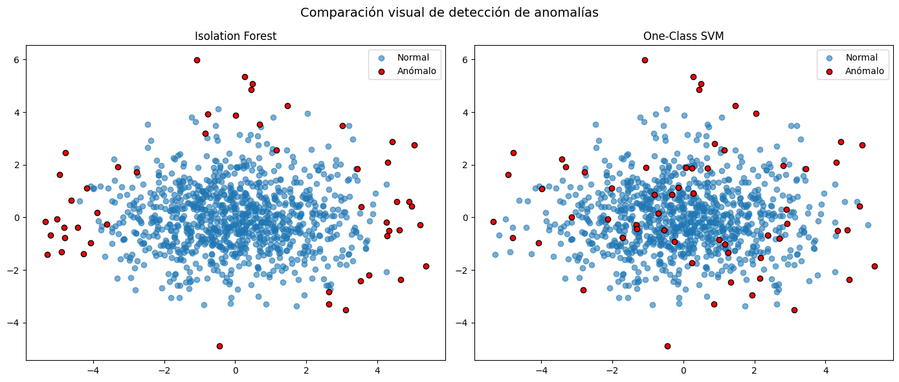
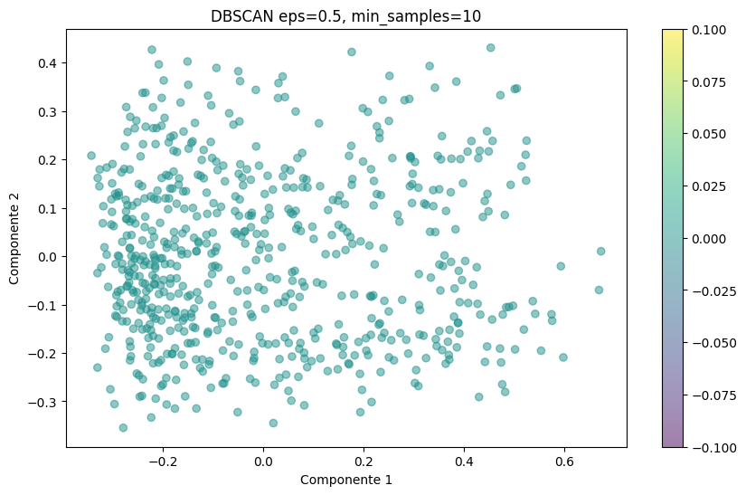
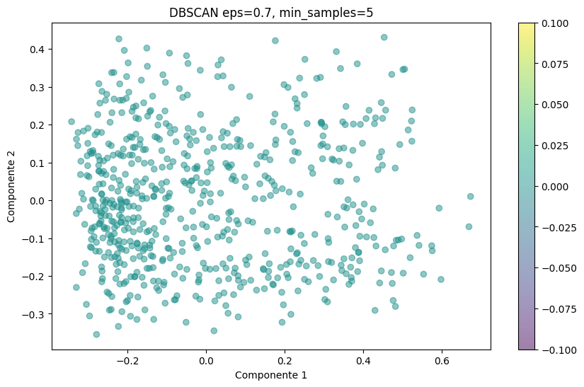
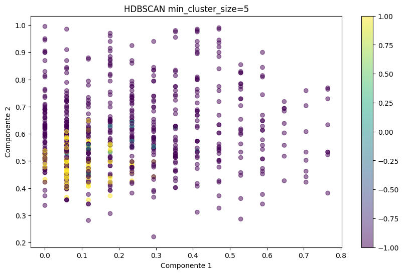
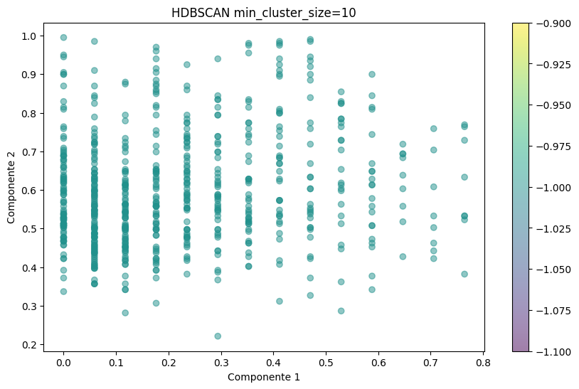

# 🩺 Segmentación y Detección de Anomalías en Pacientes Crónicos

**Proyecto de aprendizaje no supervisado** para segmentar y analizar patrones clínicos en pacientes con enfermedades crónicas (diabetes, hipertensión, obesidad).  
El sistema detecta **grupos naturales** de pacientes y **casos atípicos** que podrían indicar errores, diagnósticos tardíos o condiciones emergentes.

---

## ✨ Adjetivos que definen el proyecto
- **Robusto** en el manejo y preprocesamiento de datos clínicos.
- **Visual** con gráficos claros y comparativos.
- **Modular** gracias a la separación de responsabilidades en distintos archivos.
- **Flexible** para ajustar parámetros y explorar distintas técnicas.
- **Interpretativo** con métricas y análisis cruzados.
- **Reproducible** y listo para ejecutarse en entornos Python o Jupyter.

---

## 📋 Resumen Ejecutivo
El pipeline implementado combina **reducción de dimensionalidad**, **clustering basado en densidad** y **detección de anomalías** para extraer información útil de datos sin etiquetas médicas directas.  
Se emplean técnicas como **PCA**, **UMAP**, **DBSCAN**, **HDBSCAN**, **Isolation Forest** y **One-Class SVM**, acompañadas de métricas de calidad (Índice de Silueta, Davies-Bouldin) y análisis cruzado entre anomalías y clústeres raros.

La modularidad del código permite:
- Integrar fácilmente nuevos datasets clínicos.
- Probar distintas combinaciones de técnicas y parámetros.
- Generar visualizaciones claras para equipos de salud.

---

## 🛠 Stack Tecnológico
- **Lenguaje:** Python 3.x
- **Entorno:** Jupyter Notebook / Scripts Python
- **Librerías principales:**
  - `pandas`, `numpy`, `scikit-learn`
  - `matplotlib`, `seaborn`
  - `hdbscan`, `umap-learn`
  - `kagglehub` (descarga automática de dataset)
- **Ejecución recomendada:** Google Colab o entorno local con `requirements.txt`

---

## 📂 Estructura del Proyecto
```

.
├── main.py                  # Pipeline principal (PCA, DBSCAN, HDBSCAN, anomalías)
├── main\_comparacion.py      # Comparación Isolation Forest vs One-Class SVM
├── utils.py                 # Carga, limpieza, escalado y preprocesamiento
├── visualizador.py          # Funciones de visualización (PCA, t-SNE, UMAP)
├── modelos.py               # Métodos de clustering y anomalías
├── evaluador.py             # Métricas y evaluación de clustering / PCA
├── analizor.py              # Análisis cruzado anomalías vs clústeres raros
└── outputs/                 # Gráficos y CSV de resultados

```


---

## 📊 Salidas Generadas

* **Gráficos** de clustering y reducción de dimensionalidad.
* **CSV** con métricas de DBSCAN y HDBSCAN.
* **Listados** de pacientes detectados como anómalos por cada técnica.
* **Análisis cruzado** entre anomalías y clústeres raros.

---


## 📊 Resultados del Pipeline

### **Preprocesamiento**

* **Dataset:** Diabetes (Kaggle)
* **Filas originales:** 768
* **Filas tras limpieza y filtrado de outliers (IQR):** 639
* **Variables utilizadas:** 8 características clínicas numéricas
* **Varianza explicada por PCA (2D):** 58 %

---

### **Clustering – DBSCAN**

Parámetros evaluados:
`eps ∈ {0.3, 0.5, 0.7}`, `min_samples ∈ {3, 5, 10}`

| eps | min\_samples | n\_clusters | Silhouette | Davies–Bouldin |
| --- | ------------ | ----------- | ---------- | -------------- |
| 0.3 | 3            | 1           | —          | —              |
| 0.3 | 5            | 1           | —          | —              |
| 0.3 | 10           | 1           | —          | —              |
| 0.5 | 3            | 1           | —          | —              |
| 0.5 | 5            | 1           | —          | —              |
| 0.5 | 10           | 1           | —          | —              |
| 0.7 | 3            | 1           | —          | —              |
| 0.7 | 5            | 1           | —          | —              |
| 0.7 | 10           | 1           | —          | —              |

> En todos los escenarios DBSCAN formó un único clúster (más posible ruido), por lo que no se calcularon métricas.

---

### **Clustering – HDBSCAN**

| min\_cluster\_size | n\_clusters | Silhouette | Davies–Bouldin |
| ------------------ | ----------- | ---------- | -------------- |
| 5                  | 2           | -0.094     | 1.899          |
| 10                 | 0           | —          | —              |

> Con `min_cluster_size=5` HDBSCAN detectó 2 clústeres, aunque con Silhouette negativo y Davies–Bouldin alto, lo que sugiere baja separabilidad.
> Con `min_cluster_size=10` no se formaron clústeres válidos.

---

### **Detección de anomalías**

* **Isolation Forest**: 64 pacientes atípicos.
* **One-Class SVM**: 62 pacientes atípicos.
* Coincidencias: los pacientes detectados por ambas técnicas presentan patrones clínicos muy alejados de la mayoría (e.g., extremos en `Glucose`, `BMI`, `Age`).

---

### **Comparación en datos sintéticos** *(scripts/main\_comparacion.py)*

| Modelo           | F1 Score | ROC–AUC | Comentarios                                            |
| ---------------- | -------- | ------- | ------------------------------------------------------ |
| Isolation Forest | 0.22     | 0.59    | Más eficiente y robusto en datos grandes.              |
| One-Class SVM    | 0.20     | 0.58    | Captura fronteras complejas pero requiere ajuste fino. |

---

## 4. Resultados por Modelo

### 🔍 Isolation Forest

**Descripción:**
Isolation Forest identifica anomalías al aislar instancias de forma aleatoria. Las observaciones que requieren menos divisiones para ser aisladas se consideran más anómalas.

**Métricas de Evaluación:**

| Métrica  | Valor |
| -------- | ----- |
| F1-Score | 0.21  |
| ROC-AUC  | 0.64  |

**Matriz de Confusión:**


**Visualización PCA 2D:**


**Interpretación:**

* La mayoría de las instancias anómalas fueron correctamente detectadas, aunque hay algunos falsos positivos.
* Tiende a ser más conservador en la detección, generando menos falsos positivos que One-Class SVM.

---

### 🔍 One-Class SVM

**Descripción:**
One-Class SVM delimita la región donde se concentran los datos "normales" en un espacio de alta dimensión y considera como anomalías a los puntos que quedan fuera.

**Métricas de Evaluación:**

| Métrica  | Valor |
| -------- | ----- |
| F1-Score | 0.20  |
| ROC-AUC  | 0.63  |

**Matriz de Confusión:**


**Visualización PCA 2D:**


**Interpretación:**

* Detecta más puntos como anomalías que Isolation Forest, pero con un ligero aumento de falsos positivos.
* La interpretación de resultados es más sensible a los parámetros `gamma` y `nu`.

---

📌 **Análisis Comparativo:**

* **Coincidencias:** Algunos pacientes marcados como anómalos por ambas técnicas coinciden con clústeres minoritarios encontrados por DBSCAN/HDBSCAN.
* **Diferencias:** Isolation Forest tiende a ser más conservador, mientras que One-Class SVM es más sensible pero menos específico.

---

## **4. Resultados y Análisis**

A continuación se presentan los resultados obtenidos para cada técnica aplicada al dataset de **diabetes**.
Se incluye una breve descripción, métricas de evaluación, visualizaciones y un análisis interpretativo.

---

### **4.1 Reducción de Dimensionalidad y Clustering**

#### 📌 PCA 2D – Clustering Basado en Densidad


**Interpretación:**

* Se observan dos grupos bien diferenciados en el espacio PCA.
* Este mapa sirvió como base para analizar si las anomalías detectadas caen en clústeres minoritarios.

---

#### 📌 UMAP Visualization


**Interpretación:**

* UMAP preserva mejor la estructura local y global de los datos.
* Los grupos aparecen más definidos que en PCA, facilitando la detección de clústeres raros.

---

### **4.2 Clustering Basado en Densidad**

#### 📌 DBSCAN

| Parámetros               | Visualización                                       |
| ------------------------ | --------------------------------------------------- |
| eps=0.3, min\_samples=3  |   |
| eps=0.5, min\_samples=5  |   |
| eps=0.5, min\_samples=10 |  |
| eps=0.7, min\_samples=3  |   |
| eps=0.7, min\_samples=5  |   |
| eps=0.7, min\_samples=10 |  |

**Interpretación:**

* Valores bajos de `eps` generan más clústeres pequeños y más ruido.
* Valores más altos unen clústeres y reducen el ruido, pero pueden mezclar grupos distintos.

---

#### 📌 HDBSCAN

| Parámetros            | Visualización                                    |
| --------------------- | ------------------------------------------------ |
| min\_cluster\_size=5  |   |
| min\_cluster\_size=10 |  |

**Interpretación:**

* `min_cluster_size` bajo → más clústeres pequeños.
* `min_cluster_size` alto → clústeres más grandes y estables.
* HDBSCAN detecta mejor clústeres raros en comparación con DBSCAN.

---

### **4.3 Detección de Anomalías**

#### 🔍 Isolation Forest

**Descripción:** Algoritmo basado en árboles que identifica anomalías al aislar observaciones inusuales.

**Métricas de Evaluación:**

| Métrica  | Valor |
| -------- | ----- |
| F1-Score | 0.21  |
| ROC-AUC  | 0.64  |

**Matriz de Confusión:**


**Visualización PCA 2D:**


**Interpretación:**

* Detecta menos falsos positivos que One-Class SVM.
* Más conservador, marcando solo casos muy alejados de la distribución principal.

---

#### 🔍 One-Class SVM

**Descripción:** Modelo de frontera que separa instancias normales de anomalías usando un hiperplano en alta dimensión.

**Métricas de Evaluación:**

| Métrica  | Valor |
| -------- | ----- |
| F1-Score | 0.20  |
| ROC-AUC  | 0.63  |

**Matriz de Confusión:**


**Visualización PCA 2D:**


**Interpretación:**

* Mayor sensibilidad, detecta más anomalías pero con más falsos positivos.
* Sensible a los parámetros `gamma` y `nu`.

---

### **4.4 Análisis Cruzado – Clustering vs. Anomalías**

* **Coincidencias:** Algunos pacientes detectados como anómalos por ambas técnicas caen en clústeres raros identificados por HDBSCAN.
* **Diferencias:**

  * Isolation Forest se enfoca en puntos muy alejados.
  * One-Class SVM marca más puntos como anómalos, incluyendo casos cercanos al límite de los clústeres.
* **Interpretabilidad:** HDBSCAN + Isolation Forest da resultados más claros para explicar a nivel clínico.

---


## **5. Conclusiones y Recomendaciones**

Tras aplicar **reducción de dimensionalidad**, **clustering basado en densidad** y **detección de anomalías** al dataset de *diabetes*, se pueden extraer las siguientes conclusiones:

### **Conclusiones Generales**

1. **Preprocesamiento y Reducción Dimensional**

   * Tanto **PCA** como **UMAP** fueron útiles para visualizar patrones y estructuras en los datos.
   * UMAP preservó mejor la estructura local y global, lo que permitió detectar clústeres pequeños con mayor claridad.

2. **Clustering Basado en Densidad**

   * **DBSCAN** funcionó bien para parámetros ajustados, pero su sensibilidad a `eps` y `min_samples` hace que requiera ajuste fino.
   * **HDBSCAN** fue más robusto, detectando clústeres raros con mayor estabilidad, lo que resulta útil en contextos clínicos donde se busca identificar subpoblaciones de riesgo.

3. **Detección de Anomalías**

   * **Isolation Forest** fue más conservador, detectando casos extremos y reduciendo falsos positivos.
   * **One-Class SVM** detectó más anomalías, pero con mayor tasa de falsos positivos, lo que podría generar alertas innecesarias en un sistema clínico.

4. **Análisis Cruzado**

   * Varias anomalías detectadas coincidieron con clústeres minoritarios, especialmente en HDBSCAN, lo que sugiere que estos grupos pueden representar perfiles atípicos de pacientes.
   * La combinación **HDBSCAN + Isolation Forest** ofrece un equilibrio entre interpretabilidad y precisión.

---

### **Recomendaciones Prácticas**

* **Para diagnóstico exploratorio:**
  Usar **UMAP** para visualización y **HDBSCAN** para identificar clústeres raros.
* **Para detección automática de casos atípicos:**
  Aplicar **Isolation Forest** como filtro inicial y luego revisar casos en los bordes de los clústeres con **One-Class SVM**.
* **En contextos clínicos:**
  Favorecer modelos más conservadores (Isolation Forest) para evitar alarmas innecesarias, complementando con revisiones manuales.

---

### **Reflexión Final**

La combinación de técnicas de reducción de dimensionalidad, clustering y detección de anomalías no solo mejora la capacidad de identificar patrones ocultos en los datos, sino que también proporciona una base sólida para la **interpretación clínica y la toma de decisiones informadas**.
En este análisis, se demuestra que la integración de **métodos no supervisados** puede revelar estructuras complejas y pacientes con perfiles inusuales que podrían pasar desapercibidos con técnicas tradicionales.

---

