# NLP Clínico: Comparación SpaCy vs NLTK

## 📌 Descripción
Proyecto académico (Módulo 8, Sesión 2) orientado a **detectar similitud y términos clave en textos clínicos breves**.  
Se construye un pipeline modular para:

- **Descarga / simulación de dataset** de notas clínicas pequeñas.
- **Preprocesamiento**:
  - Limpieza básica (minúsculas, remoción de signos, números, correos, URLs).
  - Tokenización y lematización con **SpaCy** y **NLTK**.
  - Eliminación de stopwords.
- **Vectorización** con `TfidfVectorizer`.
- **Comparación corpus original vs. preprocesado**:
  - Longitud media.
  - Vocabulario.
  - Repetición de palabras.
- **Visualización** de términos más relevantes por documento.

> El objetivo es **evaluar el impacto del preprocesamiento en la calidad de los datos** y preparar el corpus para tareas posteriores de clasificación o clustering:contentReference[oaicite:2]{index=2}.

---

## 🛠️ Stack Tecnológico

- **Lenguaje**: Python 3.10 (Conda env)
- **NLP**:
  - [spaCy](https://spacy.io/) (tokenización, lematización, stopwords)
  - [NLTK](https://www.nltk.org/) (tokenización, stopwords)
- **ML / Vectorización**:
  - `scikit-learn` (`TfidfVectorizer`, métricas)
- **Visualización**:
  - Matplotlib
  - Seaborn
- **Infraestructura**:
  - Conda (manejo de ambientes)
  - JupyterLab / Notebooks
- **Opcionales avanzados** (heredados del entorno base):
  - TensorFlow GPU
  - Optuna / Ray Tune (HPO)
  - XGBoost / LightGBM / CatBoost (clasificación avanzada)

---

## ⚙️ Instalación mínima

### 1. Clonar repo (o copiar carpeta)
```bash
git clone https://github.com/usuario/nlp_clinico_spacy_nltk.git
cd nlp_clinico_spacy_nltk
```

### 2. Crear entorno Conda

```bash
conda env create -f env/environment.yml
conda activate especialidadmachinelearning
```

### 3. Descargar recursos de idioma

```bash
# Modelos SpaCy
python -m spacy download es_core_news_sm
python -m spacy download en_core_web_sm  # opcional (inglés)

# Recursos NLTK
python - <<'PY'
import nltk
for pkg in ["punkt", "stopwords", "wordnet", "omw-1.4"]:
    nltk.download(pkg)
print("NLTK listo")
PY
```

### 4. Verificar instalación

```bash
pytest tests/  # corre tests unitarios (si definidos)
jupyter lab    # abre notebooks de demo
```

---

## 📂 Estructura del proyecto

```
data/              # datasets (raw, interim, processed, external)
env/               # environment.yml (Conda)
notebooks/         # notebooks demostrativos
scripts/           # main.py y helpers
src/               # módulos Python (data, preprocessing, features, etc.)
tests/             # pruebas unitarias
reports/figures/   # gráficos de resultados
configs/           # configs YAML
docs/              # documentación adicional
```

---

## 🚀 Uso rápido

1. Ejecutar `scripts/download_small_clinical_notes.py` para obtener un dataset de prueba (mínimo 10 entradas).
2. Ejecutar `scripts/main.py` para correr todo el pipeline modular.
3. Revisar resultados en `reports/figures/` y métricas en consola.
4. Usar `notebooks/01_pipeline_demo.ipynb` para explorar el pipeline de forma interactiva.

---


## 📊 Métricas globales (JSON)

### Original (sin preprocesar)

* **Docs**: 10
* **Longitud media**: \~9.8 tokens
* **Vocabulario**: 77 términos únicos
* **Repetición**: 0.018 → baja redundancia

### Procesado con spaCy

* **Docs**: 10
* **Longitud media**: 7.4 (↓ respecto a original → textos más compactos)
* **Vocabulario**: 63 (↓ → eliminación de ruido/variantes)
* **Repetición**: 0.0 (eliminas repeticiones de palabra exacta gracias a lematización/stopwords)

### Procesado con NLTK

* **Docs**: 10
* **Longitud media**: 7.6 (ligeramente mayor que spaCy)
* **Vocabulario**: 65 (similar a spaCy, un poco más amplio → stemming conserva más variantes que lemas)
* **Repetición**: 0.0 (igual de eficiente en eliminar repeticiones exactas)

✅ **Conclusión métrica**:
Ambos reducen longitud y vocabulario (limpieza efectiva).

* **spaCy** → más “normalizado”: menor vocabulario, tokens más largos (ej. *cefalea*, *persistente*).
* **NLTK** → más “radical”: usa raíces (*cefale*, *opres*), pierde acentos, mantiene abreviaciones.

---

## 📈 Visualización TF-IDF

### Doc 1 (cefalea persistente)

* **NLTK**: tokens *consult*, *cefale*, *mare*, *refier*, *fiebr* (stems).
* **spaCy**: *consulta*, *cefalea*, *persistente*, *mareo*, *referir*, *fiebre*.
  👉 spaCy conserva la forma natural en español, más legible. NLTK da raíces truncadas.

### Doc 2 (diarrea aguda)

* **NLTK**: *diarre*, *agud*, *malest*, *abdominal*.
* **spaCy**: *diarrea*, *agudo*, *malestar*, *abdominal*.
  👉 Mismo patrón: spaCy preserva palabras completas, NLTK produce raíces sin tilde.

### Doc 3 (dolor torácico)

* **NLTK**: *torac*, *opres*, *irradi*, *izquierd*, *pendient*.
* **spaCy**: *torácico*, *opresivo*, *irradiado*, *izquierdo*, *pendiente*.
  👉 spaCy aporta precisión semántica; NLTK da variantes abreviadas.

### Doc 4 (tos seca nocturna, asma)

* **NLTK**: *tos*, *sec*, *nocturn*, *asma*, *satur*, *air*.
* **spaCy**: *tos*, *seco*, *nocturno*, *asma*, *saturación*, *aire*.
  👉 spaCy reconoce derivados y acentos; NLTK recorta.

### Doc 5 (hiperglicemia)

* **NLTK**: *hiperglicemi*, *ayun*, *ajust*, *diet*.
* **spaCy**: *hiperglicemiar*, *ajuste*, *dieta*.
  👉 aquí spaCy también tiene alguna variante rara (*hiperglicemiar*) por errores de lema, pero en general mantiene la palabra más cercana.

---

## 🧾 Interpretación final

1. **Reducción efectiva**: Ambos frameworks bajan la longitud media (\~25% menos) y reducen vocabulario (\~20%).
2. **Diferencias clave**:

   * **spaCy** → más interpretables los tokens (palabras completas, útiles en reportes médicos).
   * **NLTK (stemming)** → más agresivo; tokens más cortos pero menos legibles.
3. **Impacto en análisis posterior**:

   * Para **modelos estadísticos/clustering**, ambos funcionan.
   * Para **interpretación clínica** o visualización, **spaCy es claramente superior**.
   * Un híbrido sería: NLTK con lematización en inglés, pero en español spaCy gana.

---

## 📊 Comparación Visual: NLTK vs. spaCy

A continuación se muestran los términos más relevantes por documento, calculados con **TF-IDF**.  
Cada documento presenta dos gráficos comparativos:

- **Izquierda** → Tokens procesados con **NLTK** (stemming).
- **Derecha** → Tokens procesados con **spaCy** (lematización).

---

### 📝 Doc 1 — Consulta por cefalea persistente
| NLTK | spaCy |
|------|-------|
|  | 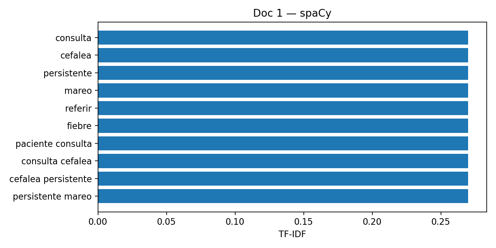 |

---

### 📝 Doc 2 — Diarrea aguda
| NLTK | spaCy |
|------|-------|
|  | 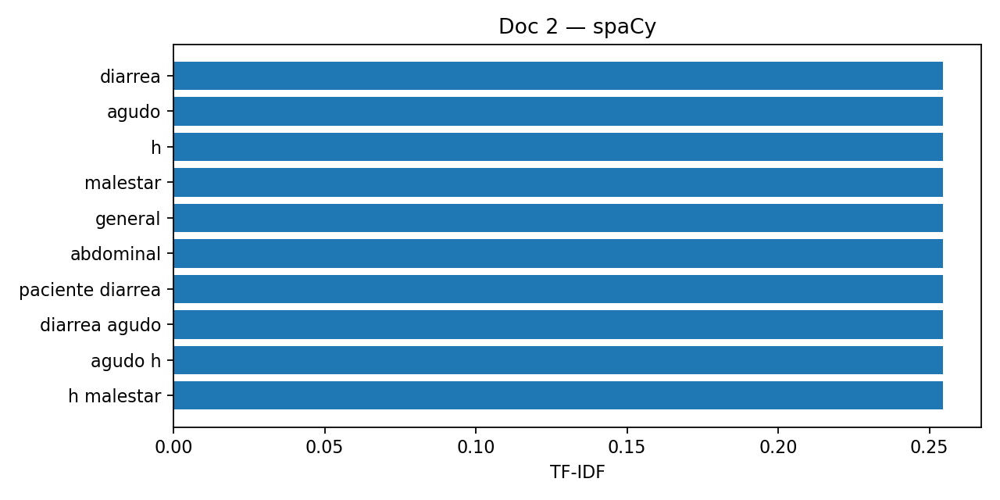 |

---

### 📝 Doc 3 — Dolor torácico
| NLTK | spaCy |
|------|-------|
| 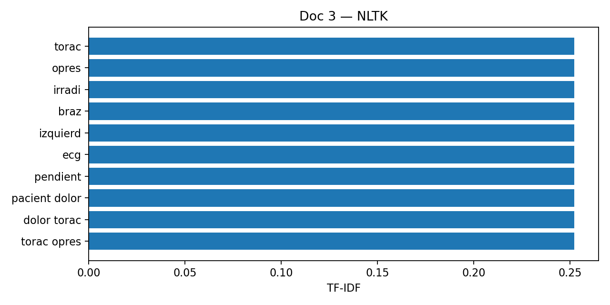 | 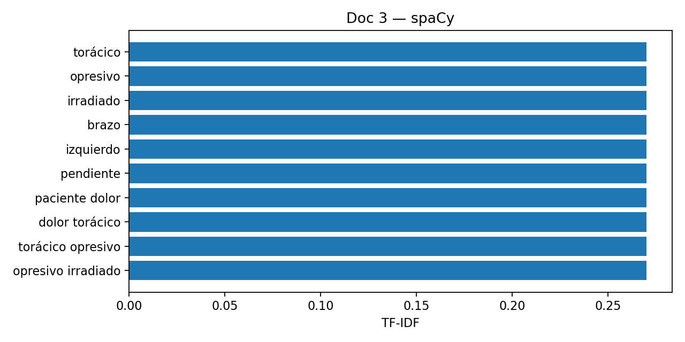 |

---

### 📝 Doc 4 — Tos seca nocturna
| NLTK | spaCy |
|------|-------|
| 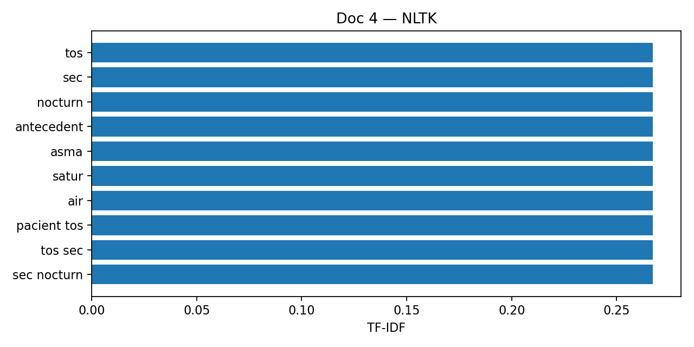 | 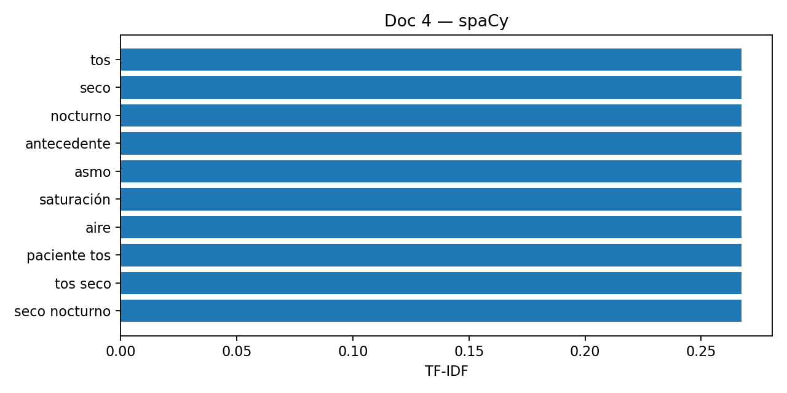 |

---

### 📝 Doc 5 — Hiperglicemia
| NLTK | spaCy |
|------|-------|
| 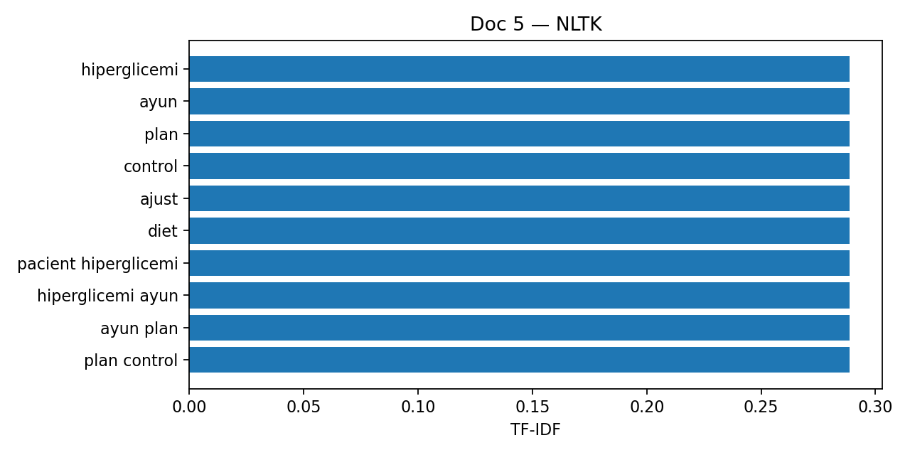 | 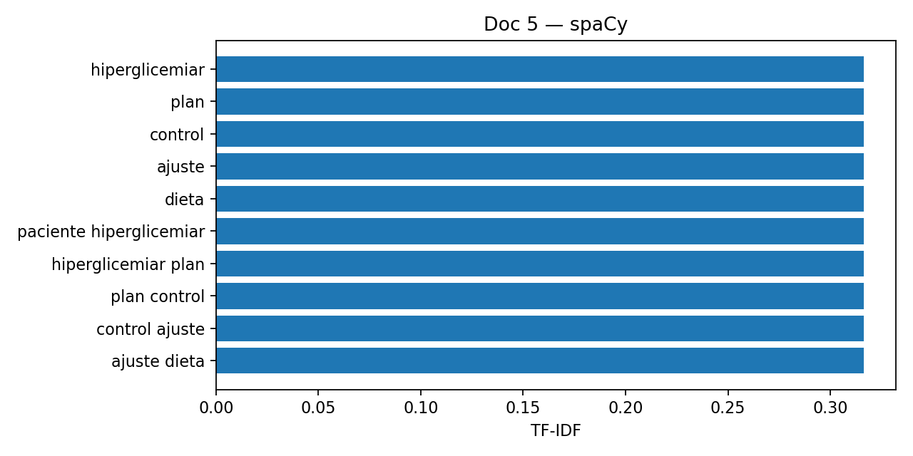 |

---

### 📝 Doc 6 — Lumbalgia mecánica
| NLTK | spaCy |
|------|-------|
|  | 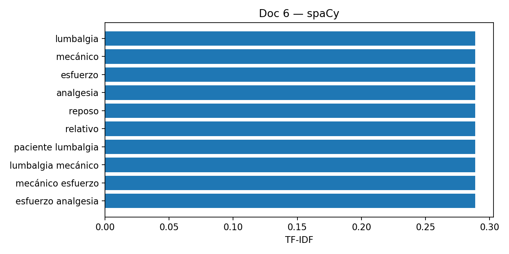 |

---

### 📝 Doc 7 — Dermatitis pruriginosa
| NLTK | spaCy |
|------|-------|
| 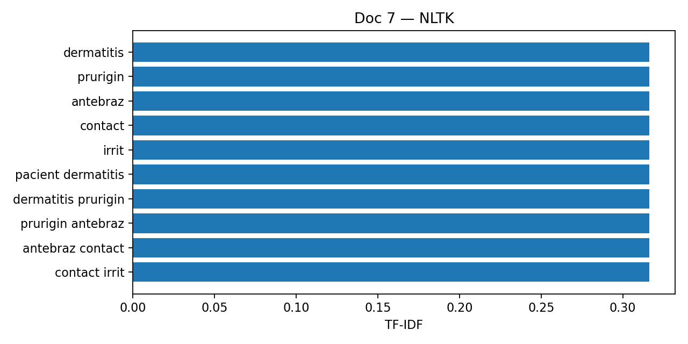 | 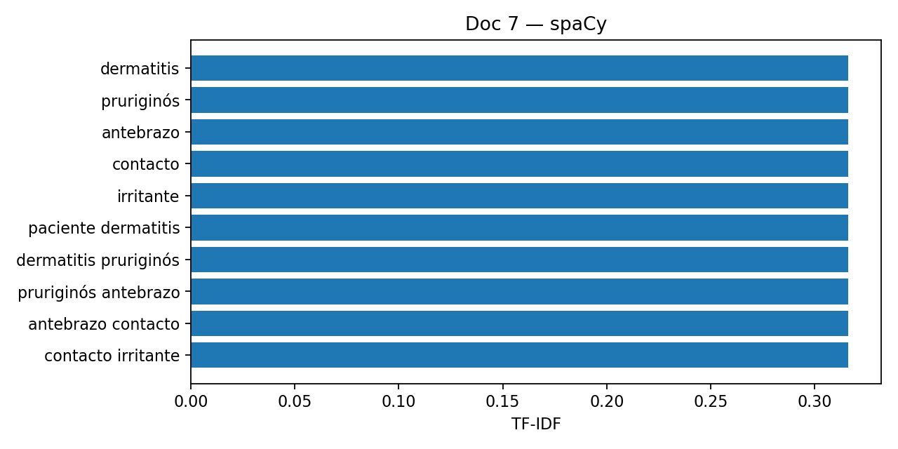 |

---

### 📝 Doc 8 — Rinitis alérgica
| NLTK | spaCy |
|------|-------|
|  | 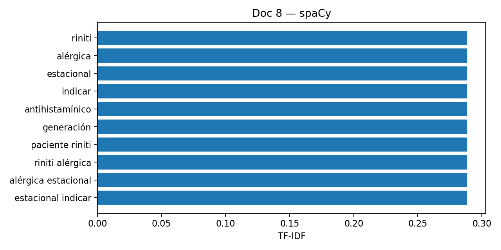 |

---

### 📝 Doc 9 — Insomnio de conciliación
| NLTK | spaCy |
|------|-------|
|  | 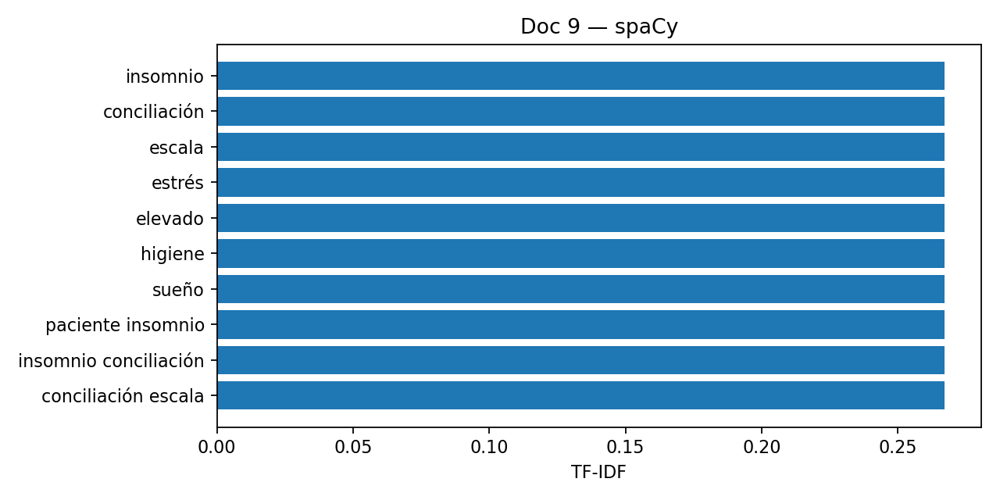 |

---

### 📝 Doc 10 — Náuseas postprandiales
| NLTK | spaCy |
|------|-------|
| 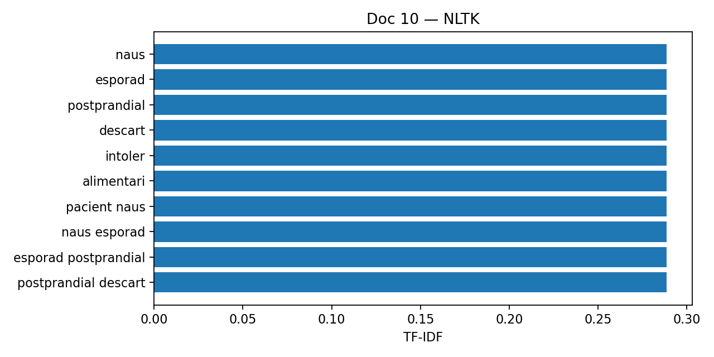 | 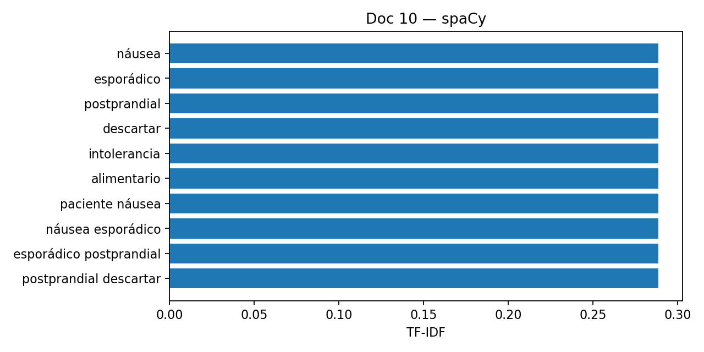 |

---

## 🔍 Observaciones generales

- **NLTK** produce raíces truncadas (*cefale, opres, irrit*), lo que reduce vocabulario pero resta legibilidad clínica.  
- **spaCy** conserva palabras completas y con tildes (*cefalea, torácico, irritante*), mejorando la interpretabilidad.  
- La **longitud media** de documentos se reduce en ambos métodos, pero spaCy ofrece un corpus más normalizado.  
- Para **análisis cuantitativo**, ambos funcionan; para **informes clínicos interpretables**, spaCy es preferible.

