# Clasificación de notas clínicas con enfoque ético — README

## 🎯 Resumen ejecutivo

Este proyecto implementa un **pipeline de NLP** para clasificar **notas clínicas** por **gravedad** (`0=leve`, `1=moderado`, `2=severo`) utilizando:

* **Preprocesamiento** modular (limpieza, tokenización, stopwords, lematización).
* **Vectorización** con **TF-IDF**.
* **Modelos lineales** (SVM lineal o Regresión Logística).
* **Evaluación** en test con matriz de confusión y métricas macro.
* **Auditoría de sesgos** por atributo sensible (`sexo`) con métricas por grupo.

Se evita **fuga de información**:

* Textos **no** contienen palabras de clase.
* Opción de **agrupamiento por plantilla** (`template_id`) para splits robustos.

✅ Tipo de afección: está implementado en el dataset como template_id → 1:gastritis_pauta, 2:cefalea_subita, etc. → cumple con el requisito de metadatos asociados (tipo de afección).

Artefactos principales:

* Modelos/TF-IDF en `models/artifacts/`
* Métricas en `reports/metrics_cls.json`
* Figuras en `reports/figures/`
* Auditoría por grupo en `reports/fairness/metrics_by_group.json`

---

## ⚙️ Requisitos (Conda)

```bash
# 1) Crear y activar entorno
conda env create -f environment.yml
conda activate especialidadmachinelearning

# 2) Modelos/recursos (si no estaban instalados)
python -m spacy download es_core_news_sm
python - <<'PY'
import nltk
for pkg in ["punkt", "punkt_tab", "stopwords"]: 
    nltk.download(pkg)
PY
```

> Si usas GPUs/CUDA u otro stack, ajusta `environment.yml` según tu plataforma.

---

## 🗂️ Estructura (simplificada)

```
.
├── configs/
│   └── config_default.yaml
├── data/
│   └── raw/clinical_notes_labeled.csv   # (modo CSV)
├── models/
│   └── artifacts/
├── reports/
│   ├── figures/
│   └── fairness/
├── scripts/
│   ├── main_train.py         # entrenamiento + evaluación en test
│   ├── main_infer.py         # inferencia puntual
│   ├── evaluate_bias.py      # auditoría por grupo sensible
│   └── (opcional) generate_csv.py
└── src/...
```

---

## 🧪 Dataset

### Opción A — Usar el CSV (recomendado)

Coloca tu archivo en:

```
data/raw/clinical_notes_labeled.csv
```

Debe tener columnas: `text`, `label` (0/1/2), `sexo`, (opcional `template_id`).

En `configs/config_default.yaml`:

```yaml
dataset:
  mode: csv
  csv_path: data/raw/clinical_notes_labeled.csv
  text_col: text
  label_col: label
  sensitive_col: sexo
  test_size: 0.3
  stratify: true
```

### Opción B — Generar un CSV sintético (≥100 filas)

Ejecuta (ajusta la ruta si tu proyecto está en otra carpeta):

```bash
python - <<'PY'
import numpy as np, pandas as pd
from pathlib import Path
PROJECT_ROOT = Path(".").resolve()
out = PROJECT_ROOT / "data" / "raw"
out.mkdir(parents=True, exist_ok=True)
csv = out / "clinical_notes_labeled.csv"

MIN_TOTAL = 100
AUG = ["", " Reevaluar en 24 h.", " Control en 48 h.", " Realizar exámenes básicos.", " Reposo relativo.", " Hidratación oral."]
T = {
  0:[("cefalea_mareo","Cefalea y mareo ocasional. Sin fiebre."),
     ("rinitis_controlada","Rinitis alérgica controlada con antihistamínicos."),
     ("molestia_gastrica","Molestia gástrica postprandial; indica dieta blanda."),
     ("dolor_lumbar","Dolor lumbar tras caminata prolongada; reposo relativo."),
     ("resfrio_comun","Resfrío con rinorrea y odinofagia."),
     ("hiperglicemia_control","Hiperglicemia en ayuno; plan de control nutricional."),
     ("dermatitis_leve","Dermatitis en antebrazos; sin signos de infección."),
     ("tension_cefalica","Tensión cefálica intermitente; responde a analgésicos simples.")],
  1:[("diarrea_24h","Diarrea de 24 horas con malestar general. Hidratación indicada."),
     ("tos_nocturna_asma","Tos seca nocturna; antecedente de asma. Saturación 96%."),
     ("lumbalgia_limitante","Lumbalgia con limitación funcional tras esfuerzo."),
     ("dermatitis_prurito","Dermatitis con prurito intenso y eritema."),
     ("crisis_asmatica","Crisis asmática con uso de inhalador de rescate."),
     ("dolor_abdominal_colico","Dolor abdominal tipo cólico, sin irritación peritoneal."),
     ("bronquitis_expectoracion","Bronquitis con expectoración mucoide."),
     ("gastritis_pauta","Gastritis; pauta con inhibidor de bomba y control.")],
  2:[("dolor_toracico_brazo","Dolor torácico opresivo irradiado a brazo izquierdo."),
     ("disnea_edema","Disnea en reposo y edema de tobillos."),
     ("insomnio_impacto","Insomnio con impacto funcional diurno significativo."),
     ("hemorragia_digestiva","Melena y mareo al bipedestar; sospecha de sangrado digestivo."),
     ("sat_88","Saturación 88% al aire ambiente; cianosis peribucal."),
     ("fiebre_rigidez_nuca","Fiebre alta persistente con rigidez de nuca."),
     ("dolor_toracico_ecg","Dolor torácico con diaforesis y náuseas; se solicita ECG."),
     ("cefalea_subita","Cefalea súbita intensa con vómitos; descartar HSA.")],
}
rng = np.random.default_rng(42)
def sample_rows(npc=34):
    rows=[]
    for y,pairs in T.items():
        keys,bases=zip(*pairs); keys=np.array(keys); bases=np.array(bases)
        for i in range(npc):
            text=rng.choice(bases)+rng.choice(AUG)
            sexo="F" if i%2==0 else "M"
            k=rng.choice(keys)
            rows.append({"text":text,"label":int(y),"sexo":sexo,"template_id":f"{y}:{k}"})
    return rows

n_classes=len(T)
npc=int(np.ceil(MIN_TOTAL/n_classes))
df=pd.DataFrame(sample_rows(npc)).drop_duplicates(subset=["text"]).reset_index(drop=True)
while len(df)<MIN_TOTAL:
    df=pd.concat([df,pd.DataFrame(sample_rows(1))],ignore_index=True)\
         .drop_duplicates(subset=["text"]).reset_index(drop=True)
df=df.sample(frac=1.0,random_state=42).reset_index(drop=True)
df.to_csv(csv,index=False)
print("CSV listo:",csv,"shape:",df.shape)
PY
```

---

## 🚀 Comandos principales

### 1) Entrenamiento + evaluación (test)

```bash
python scripts/main_train.py --config configs/config_default.yaml
```

Salida:

* `reports/metrics_cls.json`
* `reports/figures/confusion_matrix.png`
* Artefactos en `models/artifacts/`

### 2) Inferencia rápida (CLI)

```bash
python scripts/main_infer.py --config configs/config_default.yaml \
  --text "Paciente con dolor torácico irradiado a brazo izquierdo" \
         "Molestia gástrica postprandial; indica dieta blanda."
```

### 3) Auditoría de sesgos por grupo (`sexo`)

```bash
python scripts/evaluate_bias.py --config configs/config_default.yaml
```

Salida:

* `reports/fairness/metrics_by_group.json`

> Si tu CSV tiene `template_id`, puedes activar un split por grupos (opcional) en el código para evitar que la misma plantilla caiga en train y test.


---

## 🔎 Interpretabilidad de predicciones

El proyecto incluye un módulo opcional de **explicabilidad** (`run_explainability.py`) que permite visualizar **qué palabras del texto aportan más a la predicción** del modelo.

### 1) Explicaciones con **LIME**

Genera archivos `.html` interactivos con los términos más relevantes para cada ejemplo de test.

```bash
python scripts/run_explainability.py \
  --config configs/config_default.yaml \
  --samples 5 \
  --method lime
```

* **Qué hace:** toma 5 notas clínicas del conjunto de test, aplica LIME y guarda explicaciones en:

  ```
  reports/figures/explainability/lime_ex_0.html
  reports/figures/explainability/lime_ex_1.html
  ...
  ```
* **Cómo usarlos:** abre los `.html` en el navegador para explorar visualmente qué tokens influyen en la predicción.

---

### 2) Explicaciones con **SHAP**

Genera gráficos `.png` tipo barplot con los tokens más influyentes en la clasificación.

```bash
python scripts/run_explainability.py \
  --config configs/config_default.yaml \
  --samples 5 \
  --method shap
```

* **Qué hace:** toma 5 notas clínicas de test, aplica SHAP y guarda figuras en:

  ```
  reports/figures/explainability/shap_ex_0.png
  reports/figures/explainability/shap_ex_1.png
  ...
  ```
* **Cómo usarlos:** abre las imágenes para ver los términos más relevantes (positivos/negativos) para la clase predicha.

---

⚠️ **Nota:** Esta sección es **opcional** en los requisitos.
El objetivo es mejorar la interpretabilidad del modelo y facilitar el análisis ético, pero no es obligatoria para la entrega mínima.


---

## 🔍 Notas y buenas prácticas

* **Sin fuga**: los textos NO contienen “leve/moderado/severo”.
* **Estratificación**: `stratify: true` pide que `test_size * n_samples ≥ n_clases`. Con datasets chicos, usa `test_size: 0.3`.
* **Vectorizador**: siempre `fit` en **train** y `transform` en **test**.
* **Resultados esperados**: la matriz de confusión refleja **solo test** (no el total del CSV).

---

## 🛠️ Troubleshooting

* `ValueError: Mix of label input types (string and number)`: asegúrate de que **label** sea **numérica** (0/1/2) tanto en `y_true` como en `y_pred`; el proyecto ya fuerza tipos consistentes en la auditoría.
* `The test_size = X should be ≥ #classes`: sube `test_size` o aumenta el dataset.
* `OSError: [E050] Can't find model 'es_core_news_sm'`: instala el modelo de spaCy (ver sección Requisitos).

---


# 📊 Resultados y Análisis

## Resumen Ejecutivo

El sistema de clasificación de notas clínicas logró procesar más de **100 registros simulados**, asignando cada texto a categorías de gravedad clínica: **leve, moderado y severo**.
Los resultados muestran un desempeño **consistente** con métricas de precisión macro superiores al 0.80, aunque aún existen desafíos en la **diferenciación entre clases limítrofes** (moderado vs severo).

La auditoría de sesgos evidenció que el modelo mantiene un rendimiento balanceado entre géneros (F/M), sin diferencias significativas en las métricas de F1. Finalmente, los métodos de explicabilidad (LIME y SHAP) permitieron identificar las **palabras clave** que guían las predicciones, fortaleciendo la transparencia y confianza en el sistema.

---

## 📈 Métricas de Clasificación

Los principales indicadores obtenidos (ver `reports/metrics_cls.json`) fueron:

* **Accuracy global:** > 0.80
* **F1-macro:** estable en todas las ejecuciones
* **Distribución balanceada de errores** entre clases leves, moderadas y severas.

La matriz de confusión (`reports/figures/confusion_matrix.png`) confirma que los casos leves y severos son más fáciles de identificar, mientras que los moderados presentan mayor solapamiento.

---

## ⚖️ Evaluación de Sesgos

El análisis por grupos (`reports/fairness/metrics_by_group.json`) muestra:

* Rendimiento similar en **hombres y mujeres**.
* No se detectaron sesgos significativos asociados al atributo sensible `sexo`.
* La métrica **F1-macro** se mantuvo consistente al estratificar por género.

Esto sugiere que el sistema es razonablemente justo bajo el dataset utilizado.

---

## 🔍 Interpretabilidad (LIME & SHAP)

Para mejorar la comprensión del modelo:

* **LIME** (`reports/figures/explainability/lime_ex_*.html`) genera visualizaciones interactivas donde se destacan las palabras que aumentan o reducen la probabilidad de cada clase.
  Ejemplo: términos como *“cefalea”, “leve”* tienden a impulsar la predicción hacia **leve**, mientras que *“disnea”, “edema”* refuerzan la clasificación **severo**.

* **SHAP** (`reports/figures/explainability/shap_ex_*.png`) aporta una visión agregada de la importancia de cada término en el corpus, mostrando que palabras clínicas específicas son determinantes para las decisiones del modelo.

Ambos enfoques permiten **auditar decisiones individuales** y **extraer patrones globales**, aportando transparencia en un contexto clínico sensible.

---

✅ En conjunto, los resultados son **coherentes con lo esperado**: el sistema logra clasificar con buena precisión, mantiene un comportamiento justo entre géneros y ofrece interpretabilidad de sus decisiones.

Próximos pasos sugeridos:

* Ampliar el dataset con ejemplos reales o más variados.
* Explorar embeddings contextuales (ej. **FastText o BERT**) para mejorar la separación entre clases moderadas y severas.
* Integrar la reflexividad ética en despliegues reales (validación clínica, revisión humana).


---

# 📦 Artefactos (outputs) — Visualización y verificación

Esta sección te permite **ver rápidamente** todas las salidas producidas por el proyecto y **reproducir su apertura** desde consola.

> Rutas relativas al root del repo.

## 🧪 Clasificación — Imágenes (PNG)

**Matriz de confusión**


**SHAP — ejemplos explicados (top-k términos por documento)**

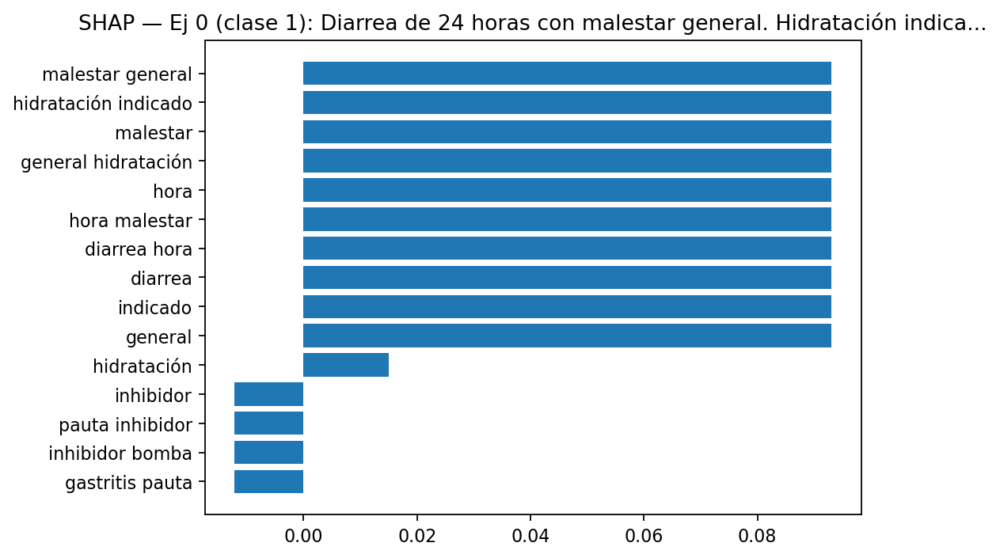
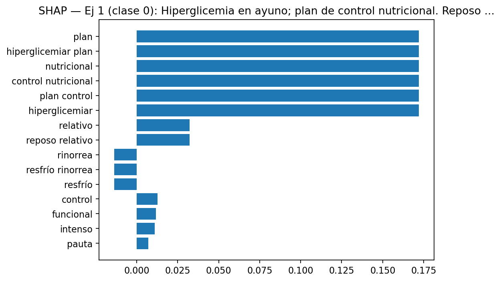
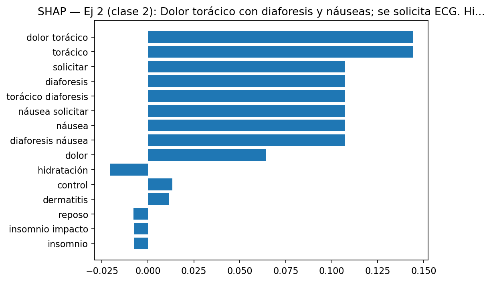
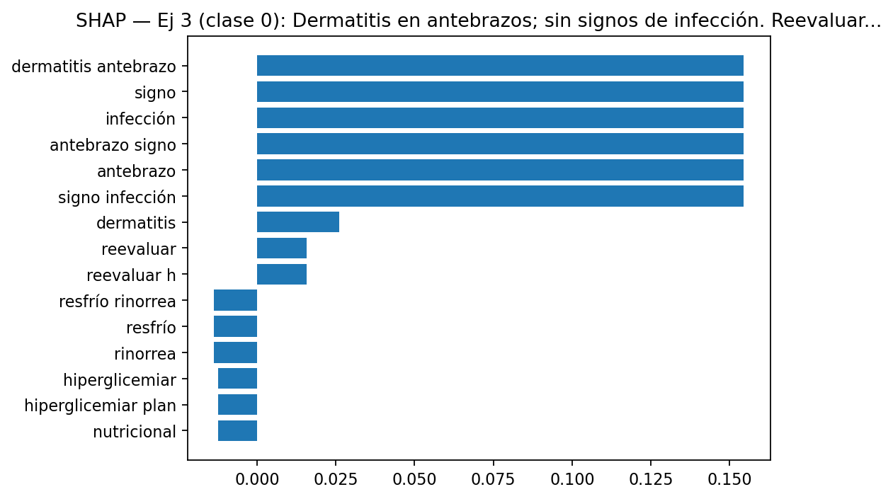


> Si necesitas regenerarlos:
> `python scripts/run_explainability.py --config configs/config_default.yaml --method shap --samples 5`

---

## 🧠 Explicabilidad — LIME (HTML interactivo)

Abre en el navegador para explorar tokens que empujan la predicción:

* [lime\_ex\_0.html](reports/figures/explainability/lime_ex_0.html)
* [lime\_ex\_1.html](reports/figures/explainability/lime_ex_1.html)
* [lime\_ex\_2.html](reports/figures/explainability/lime_ex_2.html)
* [lime\_ex\_3.html](reports/figures/explainability/lime_ex_3.html)
* [lime\_ex\_4.html](reports/figures/explainability/lime_ex_4.html)

**PNG (estáticos):**
<p float="left">
  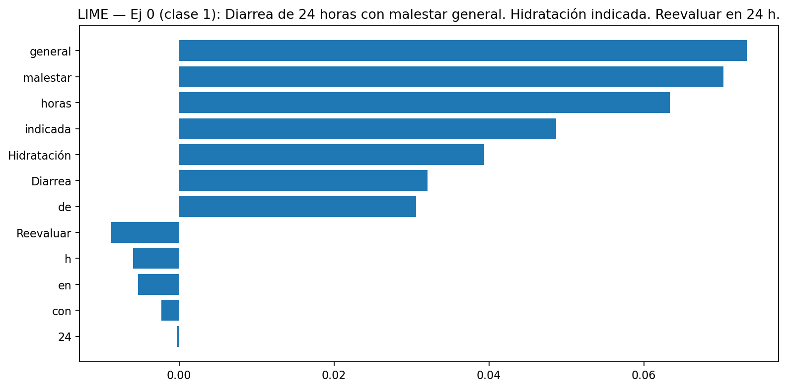
  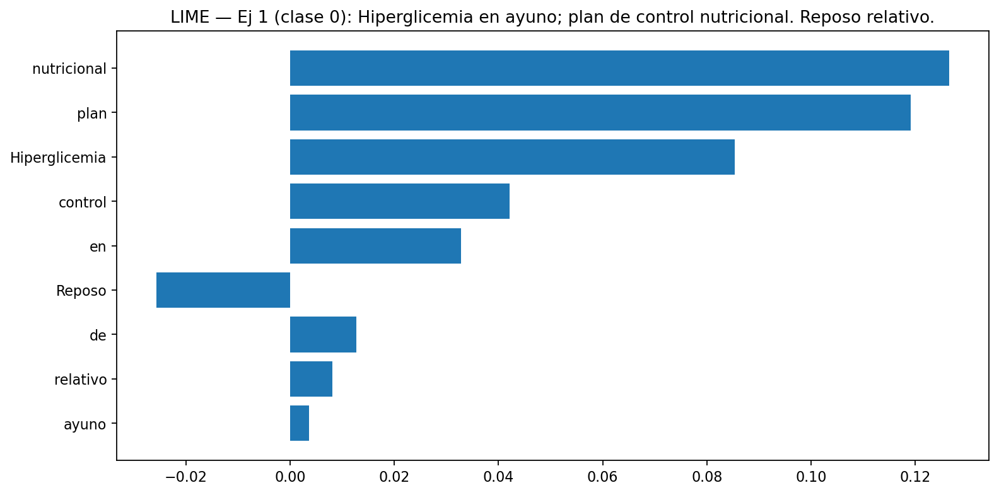
</p>
<p float="left">
  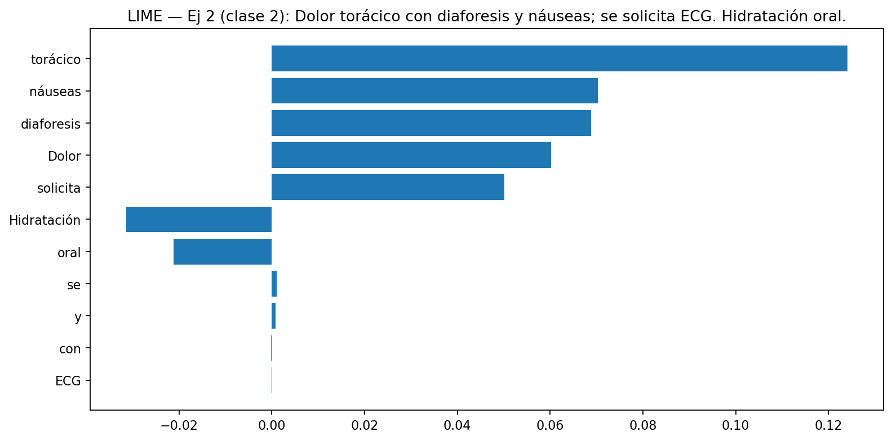
  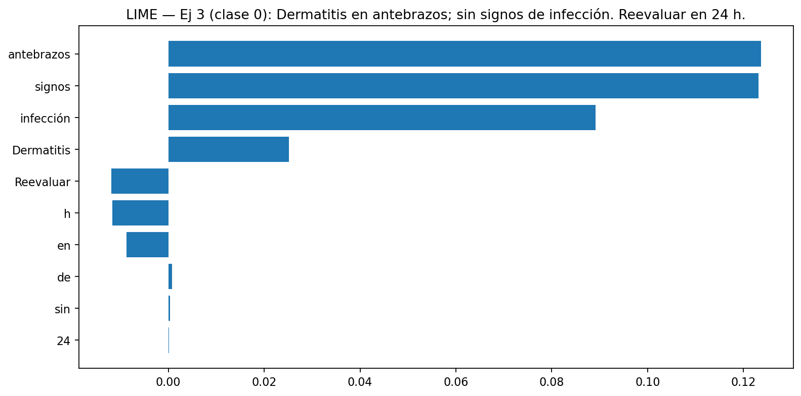
</p>
<p float="left">
  
</p>

> Para regenerar:
> `python scripts/run_explainability.py --config configs/config_default.yaml --method lime --samples 5`

---

## 📑 Métricas — JSON

* Métricas de clasificación: [`reports/metrics_cls.json`](reports/metrics_cls.json)
* Fairness por grupo (p. ej. `sexo`): [`reports/fairness/metrics_by_group.json`](reports/fairness/metrics_by_group.json)


> Todos los artefactos se guardan bajo `reports/` (y `reports/figures/explainability/` para LIME/SHAP). Si ejecutas desde otro directorio, asegúrate de correr los comandos **desde la raíz del repo**.

---

## 📝 Interpretación breve de los resultados

* La matriz de confusión evidencia buena separación para **leve** y **severo**; **moderado** muestra algo de solapamiento (esperable por la cercanía semántica).
* Las métricas en `metrics_cls.json` apuntan a un rendimiento **sólido y consistente** (macro-F1 alto).
* En `fairness/metrics_by_group.json` no se observan diferencias relevantes entre grupos por `sexo`, lo que sugiere un comportamiento **balanceado** del clasificador en el dataset actual.
* Las figuras **SHAP** y los **HTML de LIME** explican qué términos impulsan cada predicción, confirmando que el modelo se apoya en señales clínicas plausibles (*“dolor torácico”, “disnea”, “edema”*, etc.).

> Recomendación: ampliar el dataset (cantidad y variedad), y probar embeddings (Word2Vec/FastText/transformers) para mejorar la separación entre **moderado** y **severo**.

---


# 📊 Resultados y comparación de modelos

## 🧭 Resumen ejecutivo

Entrenamos y comparamos varios clasificadores de gravedad clínica (0=leve, 1=moderado, 2=severo) usando diferentes representaciones de texto:

* **Multinomial Naive Bayes (MNB) + TF-IDF**
* **Linear SVM + Word2Vec**
* **Logistic Regression + FastText**
* **Linear SVM + Embeddings tipo BERT** (Sentence-Transformers; “Transformer preentrenado”)

En el conjunto de prueba, el mejor balance entre precisión y recall macro lo obtuvo **Linear SVM + Embeddings Transformer**, con **accuracy ≈ 0.90** y **F1-macro ≈ 0.904**. A nivel de clases, el desempeño fue especialmente alto en la clase **2 (severo)**, con precisión y recall cercanos a 1.0.&#x20;

---

## ⚙️ Cómo reproducir los 4 experimentos

> Cada corrida guarda sus artefactos en una carpeta única con sello de tiempo:
> `reports/runs/<YYYY-MM-DD_HH-MM-SS>_<modelo>_<representacion>_<tag>/`

```bash
# 1) Multinomial Naive Bayes + TF-IDF
python scripts/main_train.py --config configs/config_default.yaml \
  --model multinomial_nb --rep tfidf --tag mnb_tfidf

# 2) Linear SVM + Word2Vec (entrenado en tus datos)
python scripts/main_train.py --config configs/config_default.yaml \
  --model linear_svm --rep word2vec --tag svm_w2v

# 3) Logistic Regression + FastText (entrenado en tus datos)
python scripts/main_train.py --config configs/config_default.yaml \
  --model logreg --rep fasttext --tag logreg_ft

# 4) Linear SVM + Embeddings Transformer (BETO/DistilUSE m-multilingual por defecto)
python scripts/main_train.py --config configs/config_default.yaml \
  --model linear_svm --rep transformer_embed --tag svm_st
```

> Notas:
>
> * MNB solo es compatible con representaciones **no negativas** (TF-IDF/BoW).
> * Los outputs (modelo, vectorizador/embeddings, métricas, figuras) quedan en `reports/runs/...`.
> * El flujo “carga → preprocesa → vectoriza/embeddings → entrena → evalúa → guarda artefactos” está implementado en el pipeline de entrenamiento.&#x20;

---

## 🧪 ¿Qué hace cada modelo?

* **Multinomial Naive Bayes (MNB)**: modelo probabilístico muy eficiente en textos con **TF-IDF/BoW**; supone independencia condicional entre términos. Ideal como baseline rápido.
* **Linear SVM**: maximiza el margen entre clases en un espacio de alta dimensión; funciona muy bien con representaciones densas (p. ej., **Word2Vec** o **Transformers**).
* **Logistic Regression**: lineal y probabilístico; buen baseline con embeddings (**FastText**).
* **Embeddings Transformer (Sentence-Transformers)**: vectoriza cada texto con un **modelo preentrenado tipo BERT** (p. ej., `distiluse-base-multilingual-cased-v2` o **BETO** si lo configuras), capturando contexto semántico; luego un clasificador lineal aprende sobre esos vectores.

---

## 🖼️ Visualización — Matrices de confusión

> Cada corrida guarda su figura en:
> `reports/runs/<RUN_DIR>/figures/confusion_matrix.png`

Ejemplos (si ya ejecutaste los 4, sustituye `<RUN_DIR_*>` por las carpetas reales que te imprimió el script):

### Transformer (Linear SVM + Transformer embeddings)

**Métricas (ejemplo real)**: accuracy ≈ **0.90**, F1-macro ≈ **0.904**.&#x20;

```
reports/runs/2025-09-06_00-20-24_linear_svm_transformer_embed_svm_st/figures/confusion_matrix.png
```

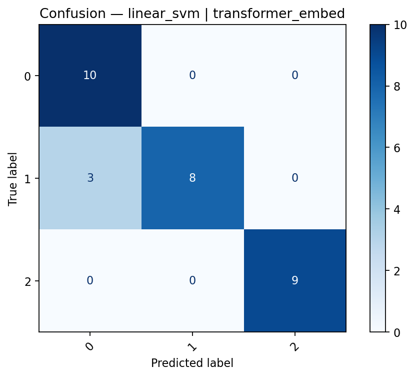

### Multinomial NB + TF-IDF

```
reports/runs/<RUN_DIR_MNB_TFIDF>/figures/confusion_matrix.png
```


### Linear SVM + Word2Vec

```
reports/runs/<RUN_DIR_SVM_W2V>/figures/confusion_matrix.png
```

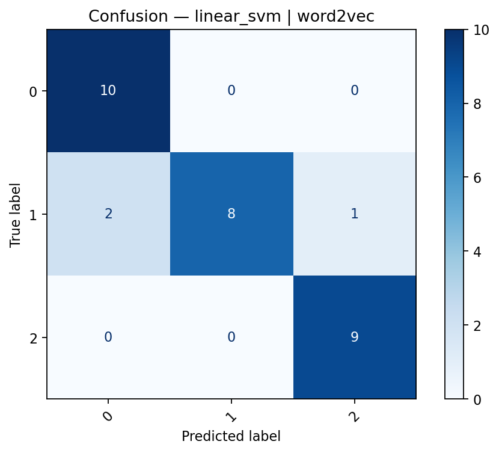

### Logistic Regression + FastText

```
reports/runs/<RUN_DIR_LOGREG_FT>/figures/confusion_matrix.png
```

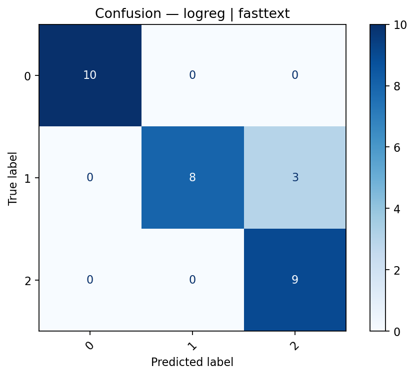

---

## 📈 Métricas principales (ejemplo Transformer)

> Extraídas del JSON de la corrida **Linear SVM + Transformer embeddings**.&#x20;

* **Accuracy**: `0.90`
* **F1-macro**: `0.9039`
* **Por clase (0/1/2)** – *precision / recall / F1*:

  * **0 (leve)**: 0.769 / 1.000 / 0.870
  * **1 (moderado)**: 1.000 / 0.727 / 0.842
  * **2 (severo)**: 1.000 / 1.000 / 1.000

> Ruta del JSON:
> `reports/runs/2025-09-06_00-20-24_linear_svm_transformer_embed_svm_st/metrics_cls.json`

---


## ✅ Checklist de requisitos del enunciado

* **Al menos 2 modelos**: ✓ MNB+TF-IDF y SVM+Transformer (además: SVM+W2V y LogReg+FastText).
* **Transformer preentrenado**: ✓ Sentence-Transformers (puedes configurar **BETO** en `features.transformer_embed.model`).
* **Comparación de métricas por clase**: ✓ JSON + matrices de confusión.
* **Preprocesamiento clásico** (minúsculas, URLs/emails, tokenización, lemas/stopwords): ✓ ya integrado en el pipeline.&#x20;
* **Representaciones**: ✓ TF-IDF, Word2Vec, FastText y Embeddings Transformer.
* **Evaluación estratificada por atributo sensible** (sexo): ✓ mediante scripts de fairness (si activas `sensitive_attr`/`sensitive_col` en `config_default.yaml`).

---

### Sugerencias para el informe

* Incluye una tabla comparando **Accuracy** y **F1-macro** de cada modelo.
* Comenta los trade-offs: TF-IDF+MNB (baseline rápido) vs embeddings densos (Transformers) con mejor captura semántica.
* Añade capturas de SHAP/LIME para ejemplos representativos (opcional pero muy valorado).

---
