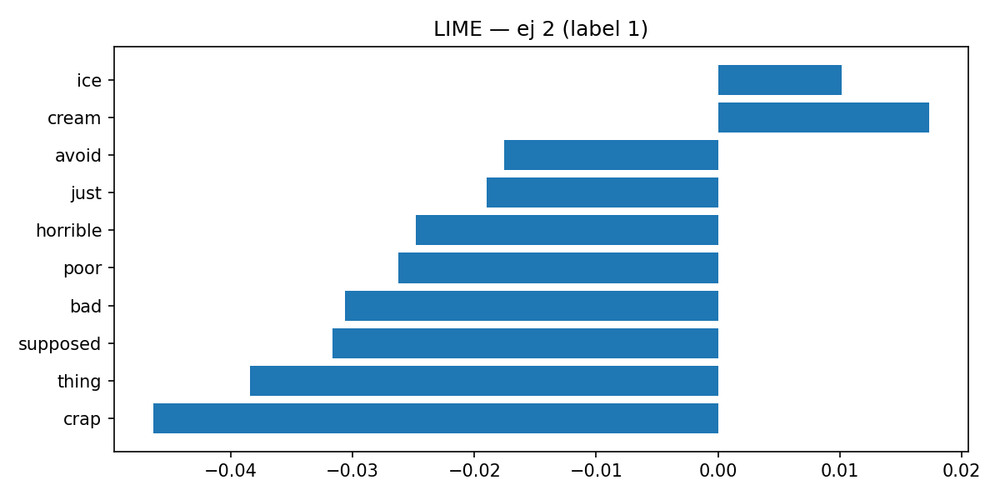
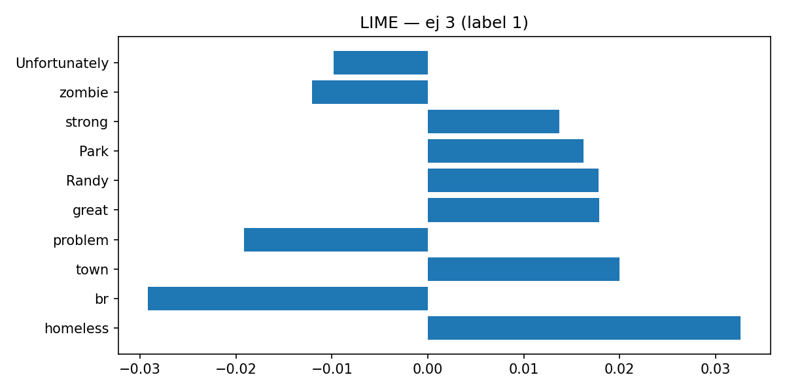
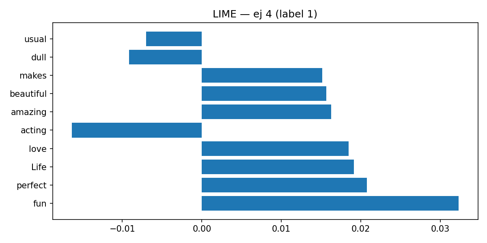
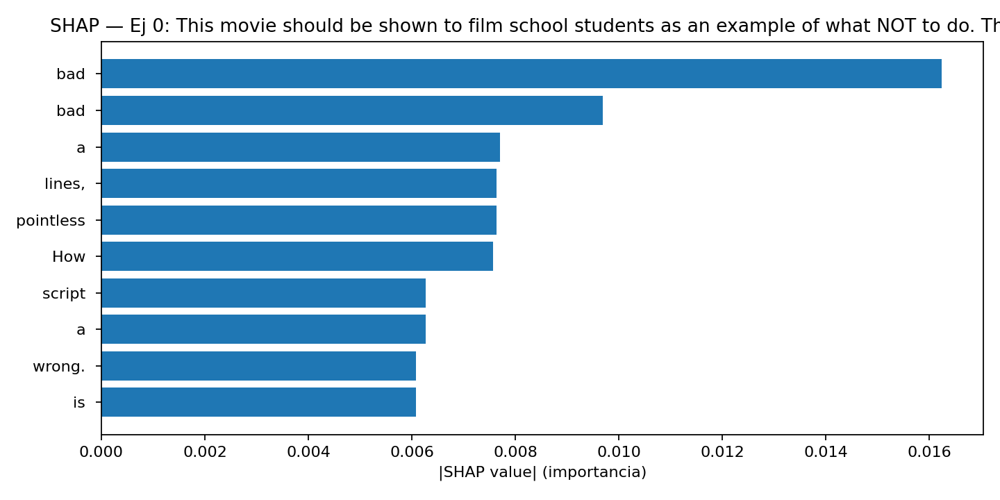
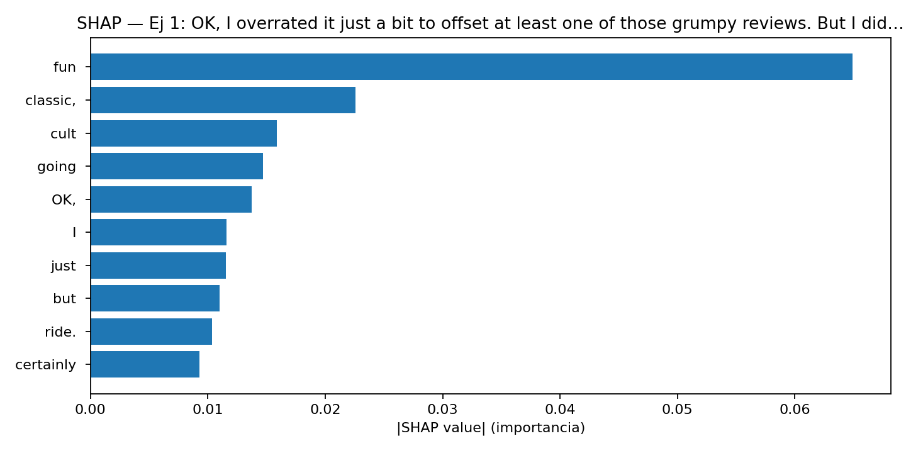
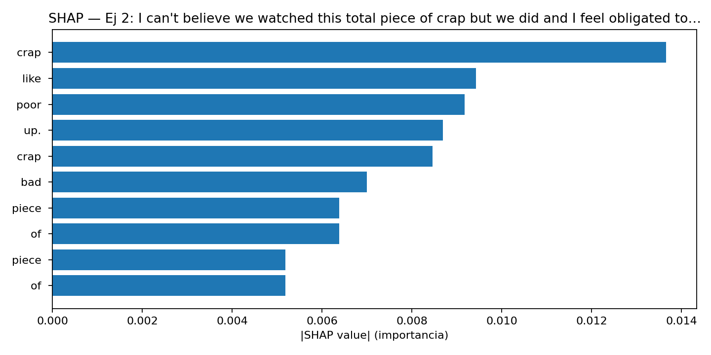

# Interpretando Modelos de Clasificación de Opiniones con LIME y SHAP

**Objetivo**: Entrenar un clasificador binario (opiniones positivo/negativo) y explicar sus predicciones con **LIME** y **SHAP**.  

## Estructura

# 📘 README — Interpretando Modelos de Clasificación de Opiniones con LIME y SHAP

## 🎯 Objetivo

Aplicar técnicas de explicabilidad (**LIME** y **SHAP**) para comprender y justificar las decisiones de un modelo de clasificación binaria de opiniones (positivo/negativo).
El fin es desarrollar criterio técnico y ético sobre cómo influyen las variables en el proceso de clasificación.

---

## ⚙️ Metodología

1. **Dataset**: Opiniones en texto (IMDb Small). Etiquetas binarias → `neg` / `pos`.
2. **Modelo**: Clasificador lineal (Logistic Regression) entrenado con `TfidfVectorizer`.
3. **Explicabilidad**:

   * **LIME**: interpretaciones locales para 5 ejemplos → exportado en **HTML** y **PNG**.
   * **SHAP**: explicaciones con `KernelExplainer` para los mismos ejemplos → exportado en **PNG**.
4. **Evaluación**: Matriz de confusión + métricas (precision, recall, F1, accuracy).

---

## 📊 Resultados

### 🔹 Métricas globales

Accuracy y F1 en torno al **85%**, lo que indica un desempeño robusto pero con margen de mejora.

```json
{
  "accuracy": 0.85,
  "f1_macro": 0.85,
  "report": {
    "neg": {"precision": 0.87, "recall": 0.83, "f1-score": 0.85},
    "pos": {"precision": 0.83, "recall": 0.87, "f1-score": 0.85}
  }
}
```

---

### 🔹 Matriz de confusión


* **neg**: 258 bien clasificados, 52 falsos positivos.
* **pos**: 253 bien clasificados, 37 falsos negativos.

---

### 🔹 Ejemplos de explicabilidad

#### LIME






#### SHAP





---

## 🔍 Comparación LIME vs SHAP

* **Coincidencia**: ambos identifican tokens clave (“bad”, “crap”, “fun”, “amazing”).
* **LIME**: más intuitivo → muestra pesos locales directamente vinculados a cada predicción.
* **SHAP**: más consistente en el marco global → cuantifica importancia relativa de cada palabra.

---

## 💡 Reflexión crítica

* **Comportamiento del modelo**: responde bien a tokens fuertes, pero puede fallar en textos ambiguos o irónicos.
* **Técnica más útil**:

  * **LIME** → claridad visual y rápida exploración.
  * **SHAP** → más riguroso y matemáticamente consistente.
* **Aspectos éticos**:

  * Riesgo de **sobreinterpretar tokens sensibles** (ej. palabras de género o salud).
  * Necesidad de **auditar sesgos** y garantizar explicaciones comprensibles para usuarios finales.

---

## ✅ Checklist de la consigna

✔ Dataset pequeño con opiniones etiquetadas.
✔ Entrenamiento de modelo binario (Logistic Regression).
✔ Explicaciones con **LIME** (≥2 instancias).
✔ Explicaciones con **SHAP** (≥2 instancias).
✔ Comparación crítica entre LIME y SHAP.
✔ Reflexión técnica + ética.

---
