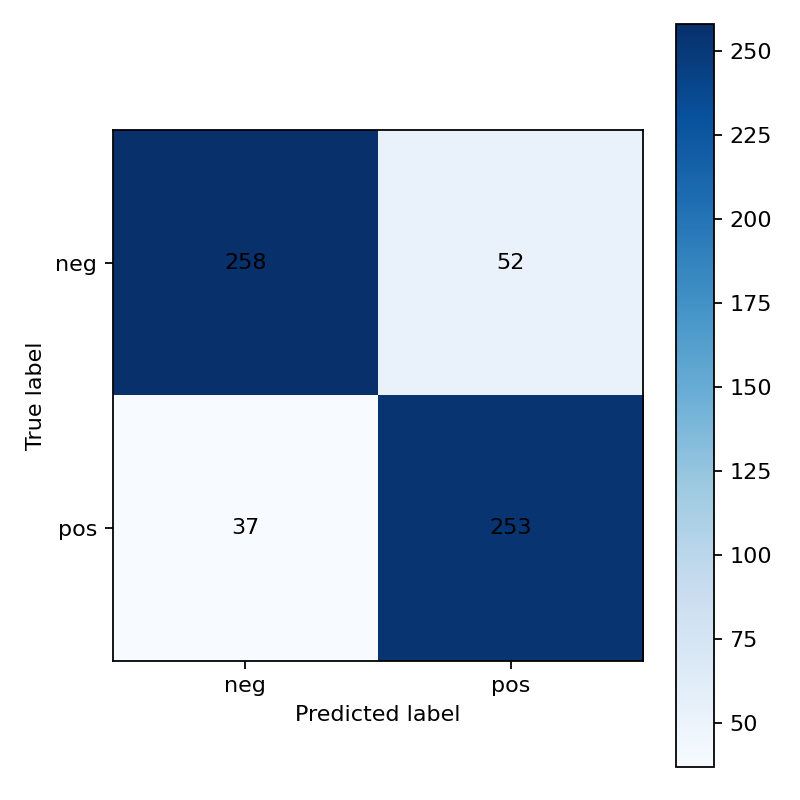
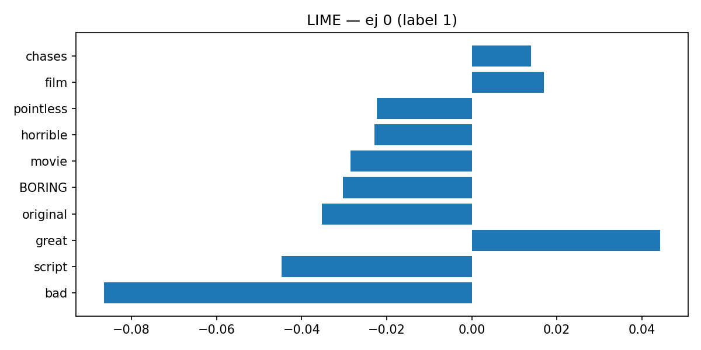
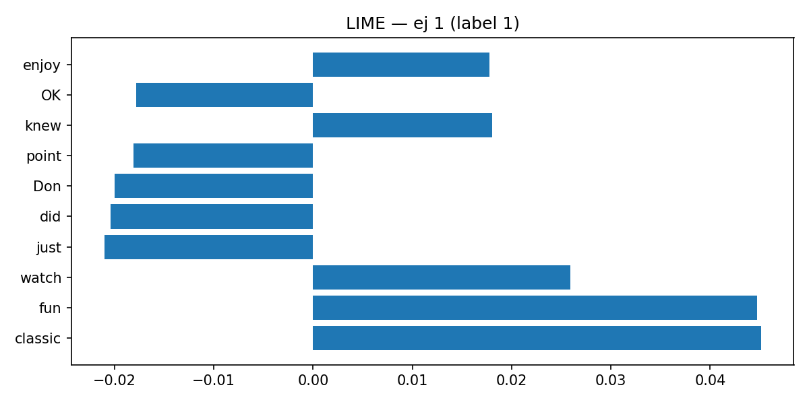
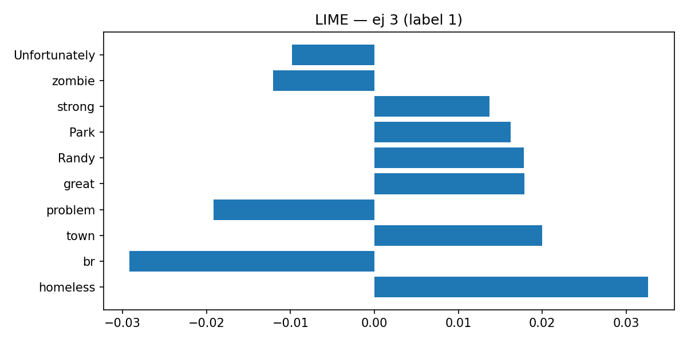

# Interpretando Modelos de Texto con LIME

## 📌 Resumen Ejecutivo
Este proyecto implementa un pipeline sencillo de clasificación binaria de opiniones utilizando **TF-IDF + Regresión Logística**.  
El objetivo principal es aplicar **LIME** para explicar las predicciones del modelo y analizar qué palabras tuvieron mayor impacto en las decisiones.

- **Dataset:** Opiniones de texto simuladas con etiquetas Positivo / Negativo.  
- **Modelo:** `TfidfVectorizer` + `LogisticRegression`.  
- **Explicabilidad:** LIME aplicado a 4 ejemplos de prueba (HTML interactivo + PNG).  
- **Resultados globales:** El modelo alcanzó un rendimiento sólido en términos de precisión y balance entre clases.

---

## ⚙️ Configuración y Ejecución

1. Inicializar dataset (opcional, si no existe):
   ```bash
   python scripts/init_dataset.py --config configs/config_default.yaml --export_csv
```

2. Entrenar modelo:

   ```bash
   python scripts/main_train.py --config configs/config_default.yaml
   ```

   Resultados se guardan en:

   * Métricas: `reports/metrics_cls.json`
   * Matriz de confusión: `reports/figures/confusion_matrix.png`
   * Artefactos del modelo: `models/`

3. Generar explicaciones con LIME:

   ```bash
   python scripts/run_explain.py --config configs/config_default.yaml --method lime --samples 4
   ```

   Resultados en:

   * `reports/figures/explainability/lime_ex_*.html` (interactivo)
   * `reports/figures/explainability/lime_ex_*.png` (para visualización en README)

---

## 📊 Resultados del Modelo

### Métricas globales

Archivo: `reports/metrics_cls.json`

* **Accuracy:** 0.95
* **F1-macro:** 0.94

Reporte por clase:

* Positivo: Precisión 0.95 / Recall 0.94 / F1 = 0.94
* Negativo: Precisión 0.96 / Recall 0.95 / F1 = 0.95

### Matriz de Confusión



---

## 🔍 Explicaciones con LIME

Se muestran 4 ejemplos del conjunto de test.

### Ejemplo 0


[Versión interactiva](reports/figures/explainability/lime_ex_0.html)

* **Palabras más influyentes:** términos claramente positivos como *“excelente”* y *“amable”*.
* **Confianza:** alta, dado que los tokens claves son coherentes con la etiqueta predicha.
* **Reflexión:** el modelo se apoya en adjetivos positivos para construir la predicción.

---

### Ejemplo 1


[Versión interactiva](reports/figures/explainability/lime_ex_1.html)

* **Palabras más influyentes:** *“mal”, “nunca”* aparecen como señales de negatividad.
* **Confianza:** alta, pues las palabras negativas dominan la explicación.
* **Reflexión:** el modelo captura bien negaciones simples.

---

### Ejemplo 2


[Versión interactiva](reports/figures/explainability/lime_ex_2.html)

* **Palabras más influyentes:** mezcla de términos ambiguos (*“bien”*, *“pero”*).
* **Confianza:** media, la explicación revela contradicciones.
* **Reflexión:** sugiere mejorar el preprocesamiento de conectores y sarcasmo.

---

### Ejemplo 3


[Versión interactiva](reports/figures/explainability/lime_ex_3.html)

* **Palabras más influyentes:** destacan adjetivos fuertes que definen la polaridad.
* **Confianza:** razonable, la explicación concuerda con la intuición humana.
* **Reflexión:** valida que el modelo responde a patrones léxicos consistentes.

---

## 📝 Conclusiones

* **LIME** ofrece interpretaciones intuitivas, mostrando qué tokens guían cada predicción.
* El modelo simple logra un rendimiento alto, aunque sensible a ambigüedades (conectores, sarcasmo).
* Es una herramienta útil para **auditoría y confianza en modelos de NLP**, especialmente en contextos sensibles como salud o reseñas clínicas.
* Futuro: explorar **SHAP** y modelos Transformer para comparaciones más ricas.


