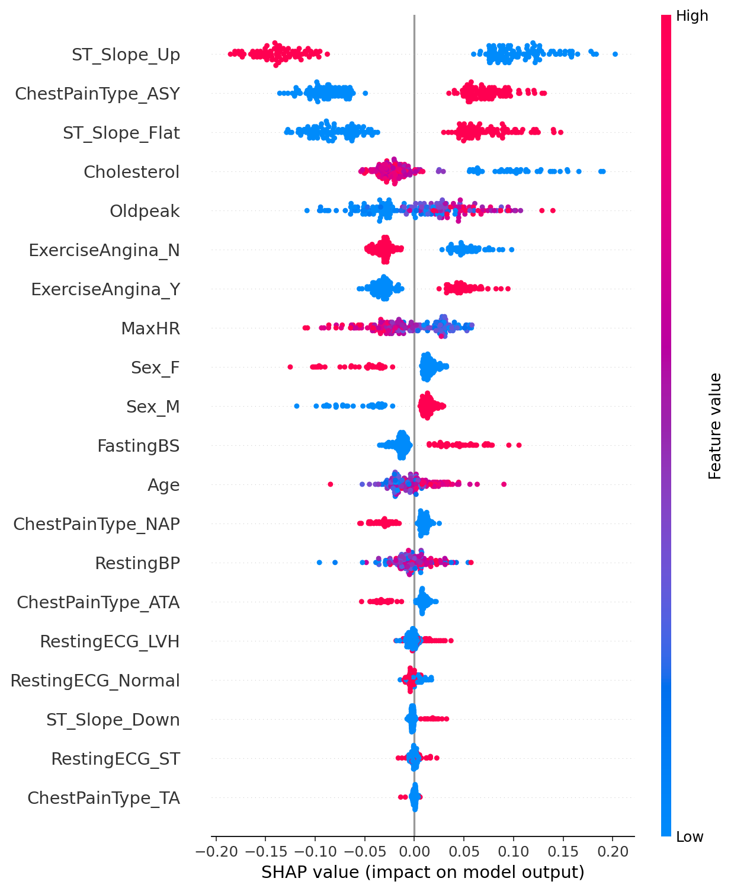
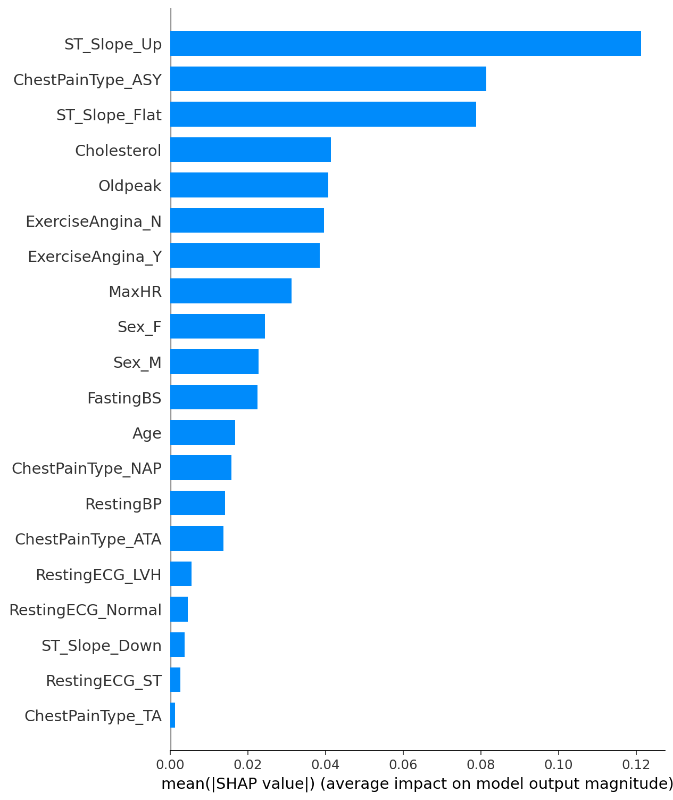
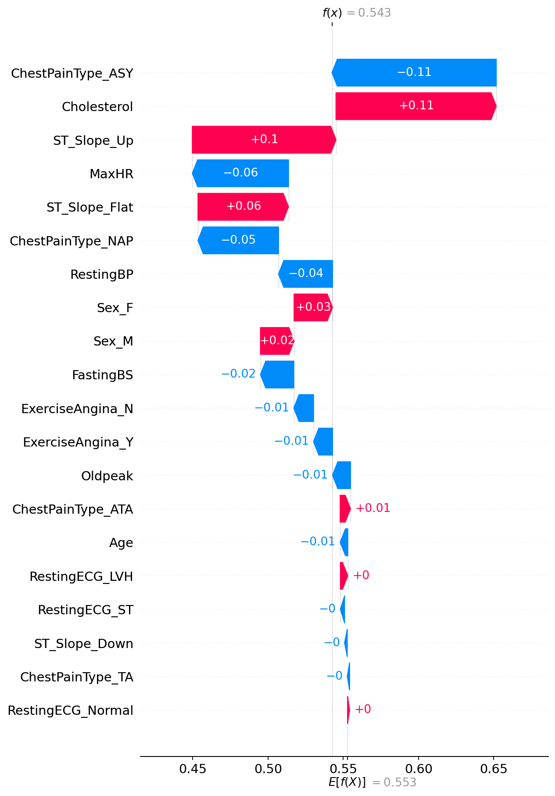
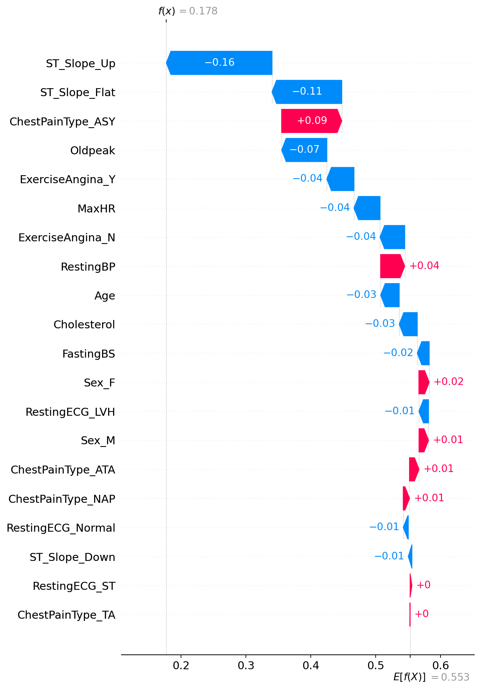
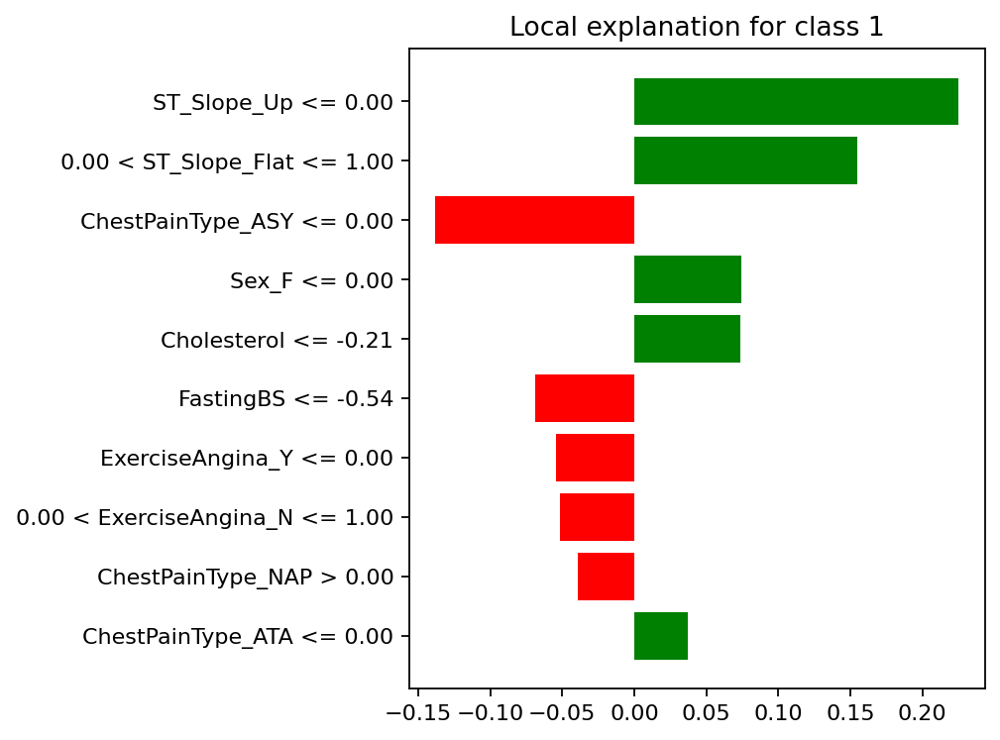
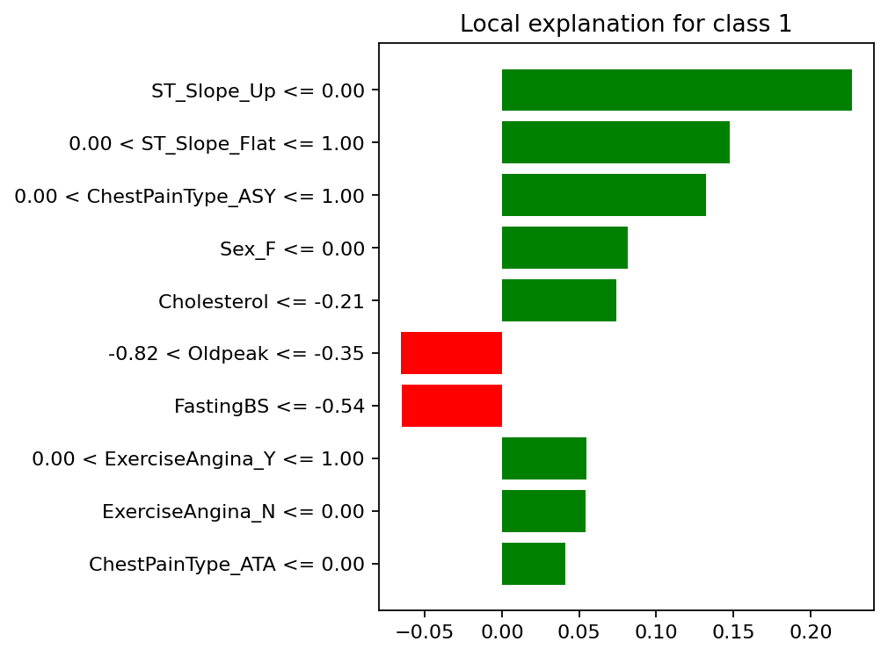
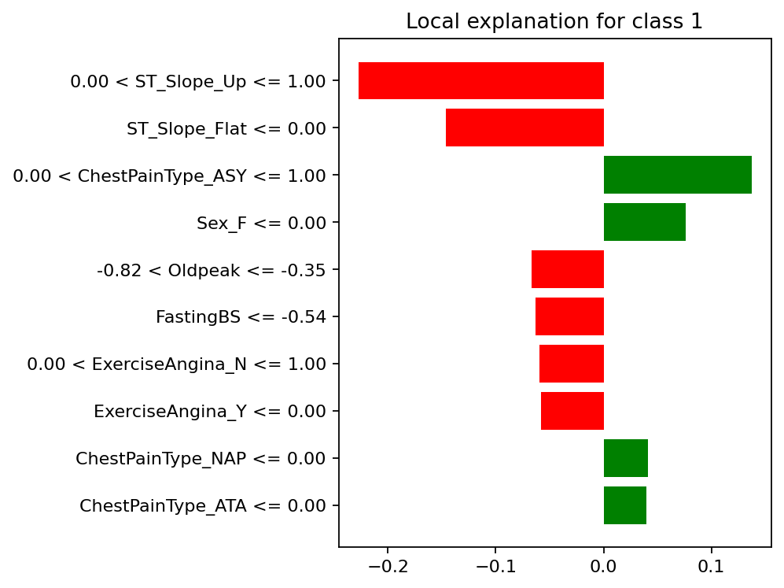

# Proyecto: Interpretabilidad de Modelos Predictivos con LIME y SHAP

## 📌 Resumen Ejecutivo

Este proyecto aborda la **interpretabilidad de modelos de clasificación** aplicados al dataset *Heart Failure Prediction (Kaggle)*.
El objetivo fue no solo entrenar un modelo con buen desempeño, sino también **explicar sus predicciones** utilizando técnicas modernas de explicabilidad: **SHAP** y **LIME**.

Los resultados muestran que el modelo Random Forest alcanza una **Accuracy del 90,8% y un F1-score del 91,9%**. Mediante SHAP y LIME se identificaron las variables más influyentes en las decisiones del modelo, destacando **ST\_Slope**, **ChestPainType** y **Cholesterol**, junto con el análisis de variables sensibles como `Sex`.

---

## 🎯 Objetivos

1. Entrenar un modelo de clasificación (Random Forest) sobre el dataset *Heart Failure Prediction*.
2. Evaluar su desempeño con métricas estándar (Accuracy, F1-score, Classification Report).
3. Aplicar **SHAP** para obtener explicaciones globales y locales de las predicciones.
4. Aplicar **LIME** para generar explicaciones locales en instancias específicas.
5. Analizar posibles **sesgos y riesgos éticos**, en particular asociados a variables sensibles.
6. Proponer mejoras al modelo y al flujo de trabajo para favorecer decisiones más responsables.

---

## 🔧 Metodología

* **Carga y limpieza:** eliminación de valores nulos y casting de variables categóricas.
* **Modelo:** Pipeline con preprocesamiento (`StandardScaler`, `OneHotEncoder`) y clasificador `RandomForestClassifier`.
* **Evaluación:** División train/test estratificada (80/20), métricas de desempeño.
* **Interpretabilidad:**

  * **SHAP:** summary plots y waterfall plots de 3 casos.
  * **LIME:** explicaciones locales para los mismos 3 casos.
* **Ética:** reporte de importancia media de SHAP y análisis de variables sensibles.

---

## 📊 Resultados

### Métricas de evaluación

```
Accuracy: 0.908
F1-score: 0.919

Classification report:
              precision    recall  f1-score   support
           0      0.922     0.866     0.893        82
           1      0.897     0.941     0.919       102
```

### Explicaciones SHAP

* **Globales:**
  
  

* **Locales (3 casos):**
  
  
  

### Explicaciones LIME

* **Locales (3 casos):**
  
  
  

---

## ⚖️ Análisis ético y de sesgo

* SHAP evidenció que variables como `Sex_F` y `Sex_M` tienen un peso no despreciable (≈0.02–0.025).
* Esto sugiere un **potencial sesgo de género** en la predicción.
* Riesgo: decisiones clínicas injustas si el modelo se aplica sin control.
* Mitigación: balancear dataset, excluir variables sensibles, usar técnicas de fairness (post-procesamiento de predicciones).

---

## 🚀 Propuestas de mejora

* Evaluar algoritmos alternativos como **XGBoost** y comparar métricas + explicaciones.
* Ajustar el preprocesamiento (outliers, normalización más robusta).
* Entrenar versiones del modelo **sin variables sensibles** y analizar el impacto.

---


