# 🧠 Especialidad Machine Learning — Talento Digital para Chile (Kibernum)

> Repositorio oficial de proyectos desarrollados durante la **Especialización en Machine Learning**, impartida por **Talento Digital para Chile** a través de la **OTEC Kibernum** (2024–2025).
> Contiene múltiples módulos y proyectos aplicados en áreas de **aprendizaje supervisado, no supervisado, NLP, MLOps, interpretabilidad y ética en IA**.

---

## 🎯 Objetivo General

Diseñar, entrenar, explicar y desplegar modelos de Machine Learning en entornos controlados, aplicando **principios de ingeniería, ética y reproducibilidad**.
El repositorio reúne proyectos de distinto enfoque (supervisado, no supervisado y MLOps), cada uno con sus respectivos resultados, documentación y código ejecutable.

---

## 🧩 Estructura General del Repositorio

```bash
EspecialidadMachineLearningTD/
│
├── Modulo3EvalMod_MarcoParra/           # Regresión lineal y optimización (GD/SGD)
├── Modulo5OptimizacionHiperparametros/  # RayTune, Optuna, Skopt, GridSearch, etc.
├── Modulo7ScoringCrediticio/            # Modelos de riesgo crediticio (LogReg, RF)
├── Modulo8RedesNeuronales/              # DNN y ResNet aplicadas a German Credit
├── Modulo9ClusteringAnomalias/          # Segmentación no supervisada y anomalías
├── Modulo10MLMLOpsDocker/               # API ML contenerizada con Flask + Docker
├── NLP_NotasClinicas/                   # Clasificación de notas clínicas (TF-IDF, LIME, SHAP)
├── Interpretabilidad_LIME_SHAP/         # Explicabilidad de modelos tabulares
└── README.md                            # Este documento
```

Cada módulo incluye su propio `README.md`, con instrucciones de instalación, ejecución, métricas y visualizaciones.


---

# ⚙️ Tech Stack Consolidado — Especialidad Machine Learning


---

## 🤖 Machine Learning & Deep Learning


---

## 💬 Procesamiento de Lenguaje Natural (NLP)


---

## 🔍 Interpretabilidad y Ética


---

## 🧩 MLOps, APIs & Contenerización


---

## 🌐 Web, Backend & Cloud


---

## 🧠 Análisis, Visualización y Ciencia de Datos


---

## 🧰 Dev Tools & Reproducibilidad


---


## 🧠 Principales Proyectos

### 1️⃣ Regresión Lineal y Métodos de Optimización

📁 `Modulo3EvalMod_MarcoParra/`

* **Objetivo:** comparar *Gradient Descent* y *Stochastic Gradient Descent* en un problema de regresión lineal.
* **Tecnologías:** Python, NumPy, Matplotlib, pytest.
* **Resultados:** ambos métodos convergen hacia la solución analítica con diferencias de estabilidad; se implementan tests automatizados y manejo de excepciones.
* **Output:** `Modulo3Clase4/outputs/comparacion_gd_sgd.png`
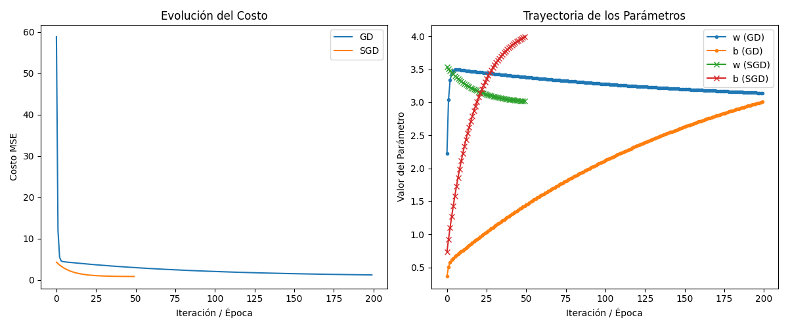

---

### 2️⃣ Optimización de Hiperparámetros

📁 `Modulo4ptimizacionHiperparametros/`


* **Objetivo:** evaluar diferentes técnicas de *hyperparameter tuning* (GridSearch, RandomSearch, Optuna, RayTune, Skopt, Hyperopt).
* **Modelo base:** `RandomForestClassifier`.
* **Conclusión:** la validación cruzada (CV) evita sobreajuste y refleja mejor el rendimiento real.
* **Resultados visuales:** curvas ROC, matrices de confusión y comparativas de métricas.
* **Output:** `Modulo5OptimizacionHiperparametros/outputs_cv/comparacion_metricas_modelos.png`

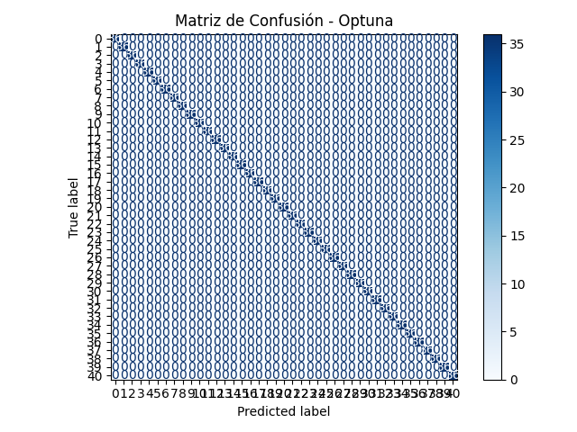
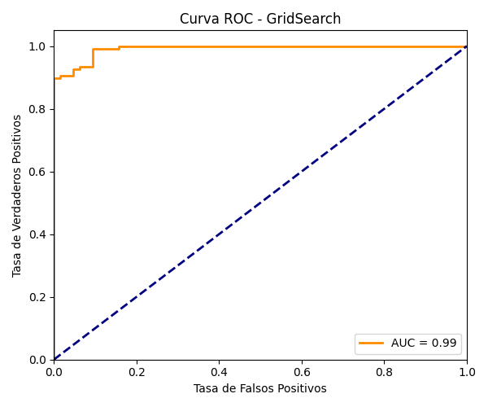


### 7️⃣ Sistema Inteligente de Scoring Crediticio con Redes Neuronales Profundas

📁 `Modulo7RedesNeuronales/`

* **Objetivo:** desarrollar un sistema de *scoring crediticio* que combine precisión, explicabilidad y robustez mediante redes neuronales profundas (DNN y ResNet tabular) sobre el dataset **German Credit (UCI)**.
* **Tecnologías:** Python 3.10 | TensorFlow 2.15 | scikit-learn | SHAP | LIME | Matplotlib | Seaborn.
* **Enfoque:** comparación de dos arquitecturas (DNN vs ResNet) bajo el mismo preprocesamiento y conjunto de hiperparámetros, incorporando análisis de costos (FN > FP) y evaluación de interpretabilidad.
* **Resultados principales:**
  - **Accuracy (test):** 0.76  |  **AUC:** 0.81  |  **F1-Score:** 0.44  
  - **Costo esperado:** ≈ 191 unidades (penalización FN × 5).  
  - **Variables más influyentes (SHAP):** `credit_amount`, `duration_months`, `status_checking`, `credit_history`.

---

#### 📊 Gráficos de Resultados

<p align="center">
  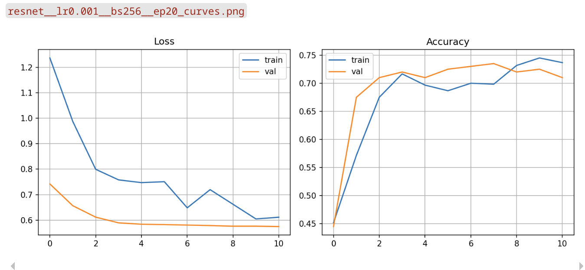
  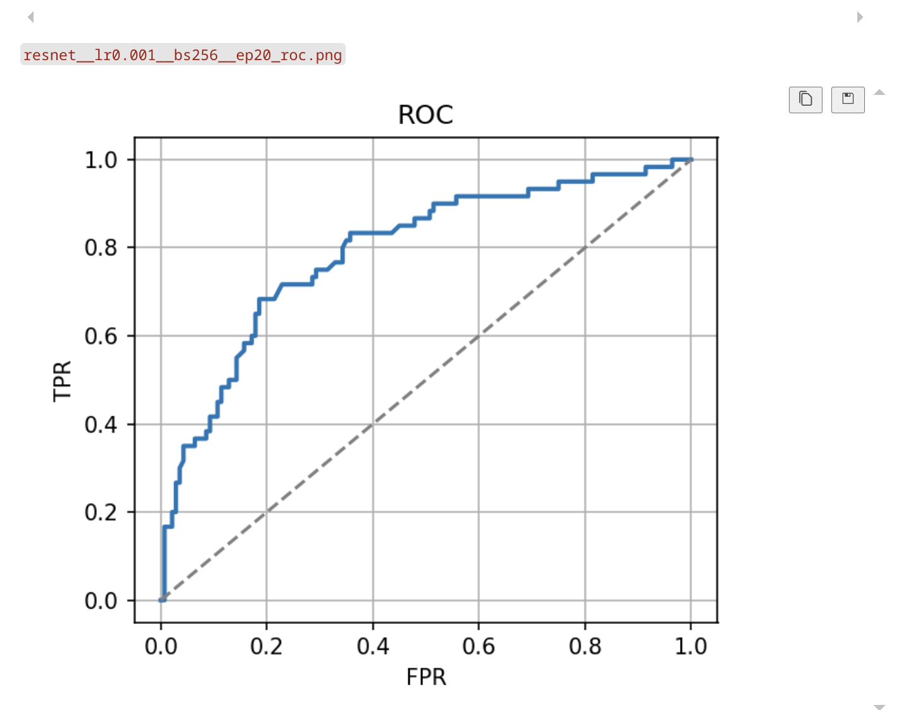
</p>

<p align="center">
  
  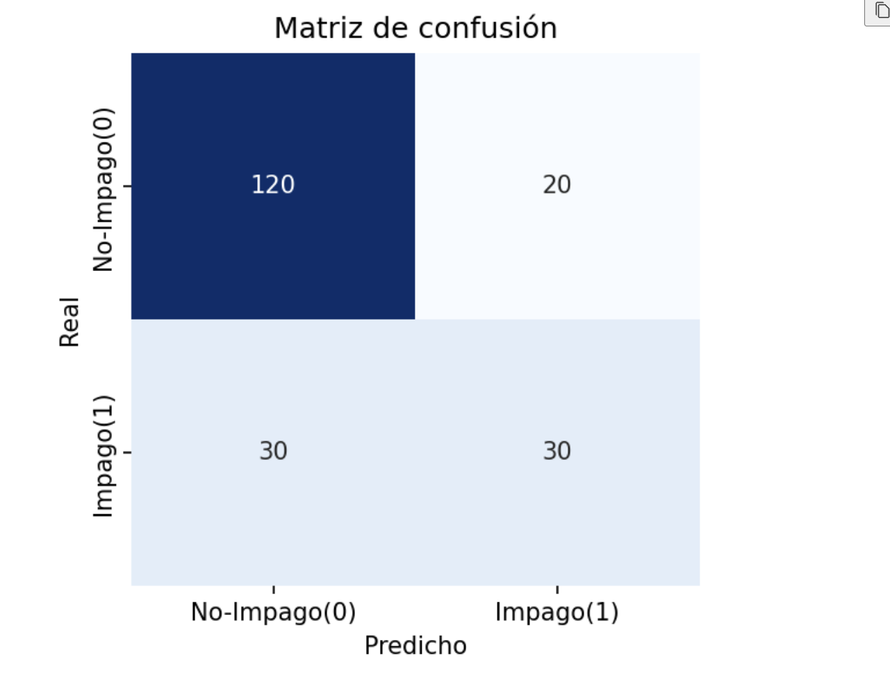
</p>


---

### 4️⃣ Redes Neuronales Profundas para Scoring Crediticio

📁 `Modulo8RedesNeuronales/`

* **Objetivo:** comparar una **DNN** y una **ResNet tabular** para predecir impago en *German Credit (UCI)*.
* **Tecnologías:** TensorFlow/Keras, scikit-learn, SHAP, LIME, Matplotlib.
* **Enfoque:** mismos preprocesos e hiperparámetros base; análisis de costos (FN > FP) y explicabilidad.
* **Outputs clave (gráficos):**

<p align="center">
  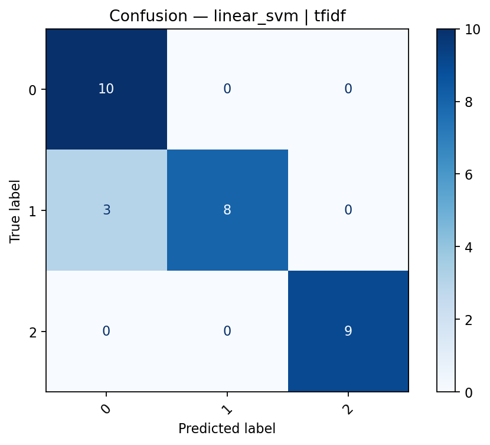
  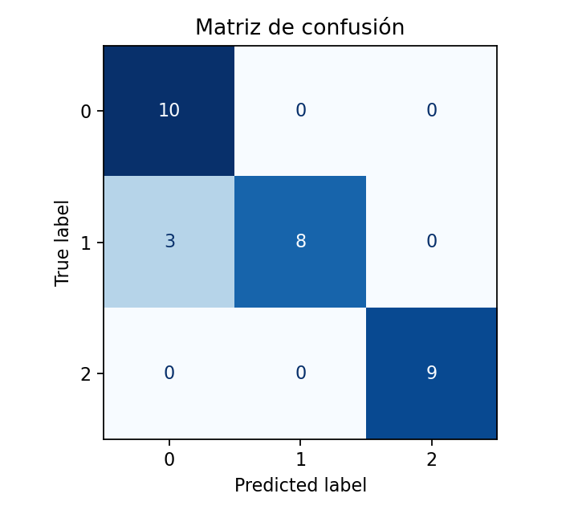
</p>
/home/mparraf/myprojects/EspecialidadMachineLearning/
<p align="center">
  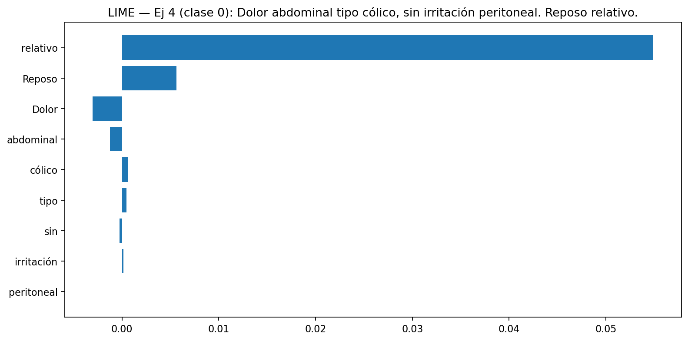
  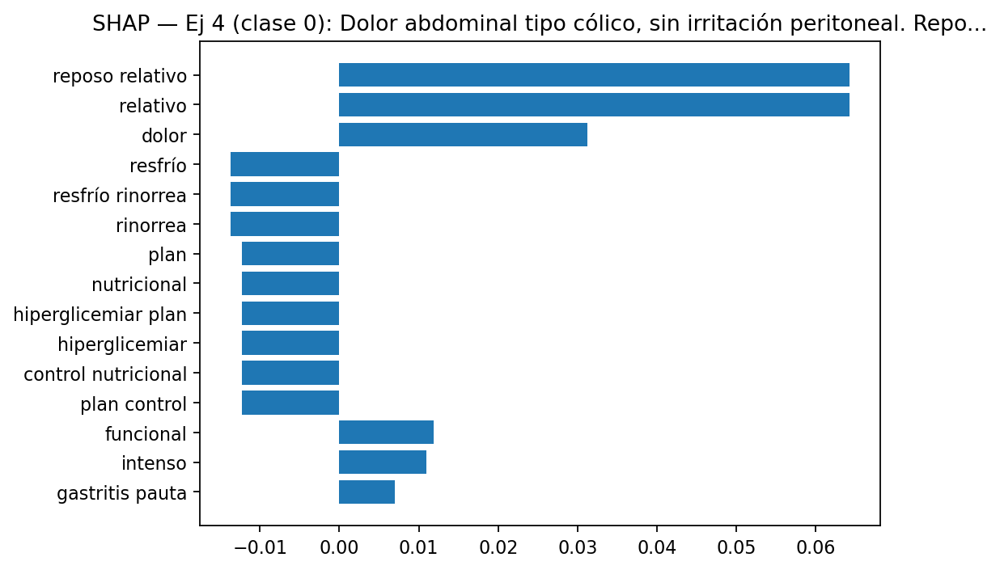
</p>

> **Cómo leerlos:**
> - *Curves:* pérdida cae y la accuracy de validación se estabiliza (indica aprendizaje sin sobreajuste severo).
> - *ROC:* capacidad de discriminación entre impago/no-impago (AUC alto = mejor).
> - *SHAP:* variables con mayor impacto en la predicción (p. ej., `duration_months`, `credit_amount`).
> - *Matriz:* distribución de aciertos/errores; recuerda ponderar el costo de **FN** frente a **FP**.


---

### 5️⃣ Scoring Crediticio con Interpretabilidad (Lasso/Ridge, SHAP & LIME)

📁 `Modulo5Clase6EvalModMarcoParra/`

* **Objetivo:** construir un modelo de *scoring crediticio* para predecir el riesgo de impago utilizando **técnicas de regularización** (L1/L2) y métodos de **interpretabilidad** como **SHAP** y **LIME**.  
* **Modelos:** Logistic Regression (Lasso/Ridge) · Random Forest.  
* **Dataset:** `credit` (OpenML)  
* **Evaluación:** Accuracy, F1, AUC, Matriz de confusión y Curva ROC.

---

#### 📊 Comparación de Modelos

| Modelo              | Accuracy | F1-Score | AUC  |
|----------------------|----------|----------|------|
| **Random Forest**    | 0.779    | 0.775    | 0.858 |
| **Logistic Regression** | 0.729 | 0.700    | 0.794 |

📎 *Random Forest ofrece mejor capacidad predictiva; Logistic Regression aporta interpretabilidad y transparencia regulatoria.*

---

#### 📈 Visualizaciones de Resultados

<p align="center">
  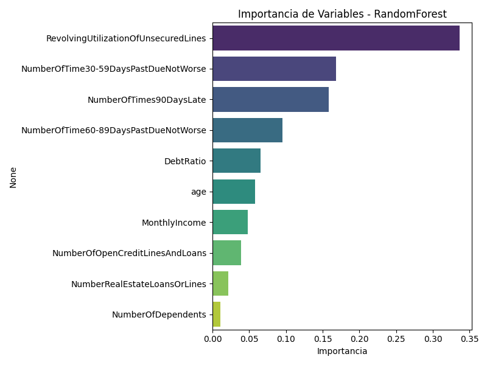
  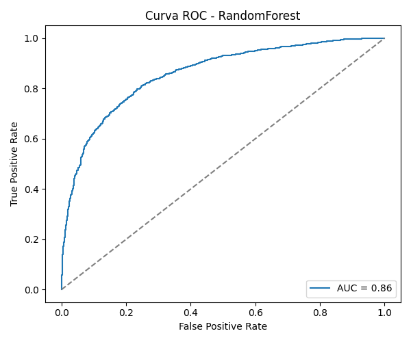
</p>

<p align="center">
  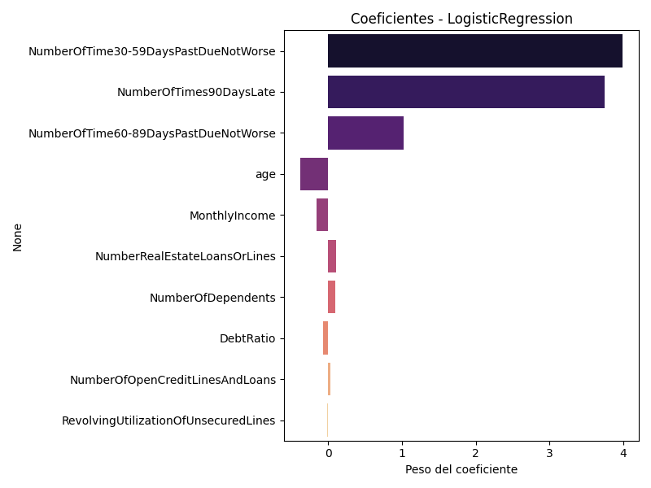
  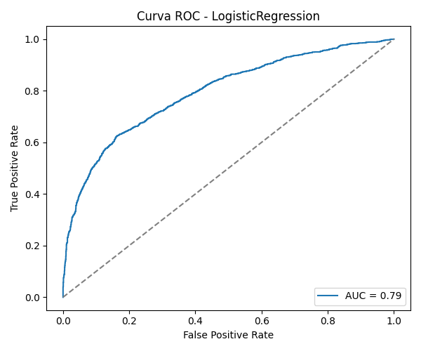
</p>

> **Interpretación breve:**  
> - **Random Forest:** logra mayor AUC y mejor equilibrio entre precisión y recall.  
> - **Logistic Regression:** permite interpretar directamente el impacto de cada variable.  
> - **SHAP/LIME:** refuerzan la trazabilidad y explicabilidad de las decisiones.

---

#### 💬 Conclusión
La combinación de **Random Forest + SHAP/LIME** entrega un modelo potente y explicable para scoring crediticio, ideal para uso en sistemas financieros donde se requiere **precisión y transparencia**.

---

### 9️⃣ Interpretabilidad de Modelos Predictivos (LIME & SHAP)

📁 `Modulo9Interpretabilidad_LIME_SHAP/`

* **Objetivo:** ilustrar la explicabilidad de un modelo **Random Forest** aplicado al dataset *Heart Failure Prediction (Kaggle)*, utilizando **SHAP** y **LIME** para entender qué variables determinan las predicciones.
* **Modelo base:** Random Forest Classifier (Accuracy ≈ 0.91, F1 ≈ 0.92).
* **Variables más influyentes:** `ST_Slope`, `ChestPainType`, `Cholesterol`.

---

#### 📊 Ejemplos de Interpretabilidad

<p align="center">
  
  
</p>

<p align="center">
  
  
</p>

> **Interpretación breve:**  
> - **SHAP** muestra el efecto promedio de cada variable y cómo influye en casos individuales.  
> - **LIME** explica localmente qué características impulsan o reducen la probabilidad de la clase positiva.  
> - Ambos métodos permiten **auditar decisiones** y **detectar posibles sesgos** asociados a variables sensibles.

---

📈 *El módulo demuestra cómo integrar explicabilidad y ética en modelos de Machine Learning aplicados a salud, reforzando transparencia y trazabilidad.*

---

### 6️⃣ Segmentación y Detección de Anomalías en Pacientes Crónicos

📁 `Modulo6EvalModularMarcoParra/`

* **Objetivo:** aplicar técnicas **no supervisadas** (clustering y detección de anomalías) para identificar **patrones clínicos** y **pacientes atípicos** en un dataset de enfermedades crónicas (diabetes, hipertensión, obesidad).
* **Técnicas principales:** PCA · UMAP · DBSCAN · HDBSCAN · Isolation Forest · One-Class SVM.  
* **Dataset:** *Diabetes (Kaggle)* · 639 registros post-filtrado · 8 variables clínicas numéricas.

---

#### 📊 Visualizaciones de Resultados

<p align="center">
  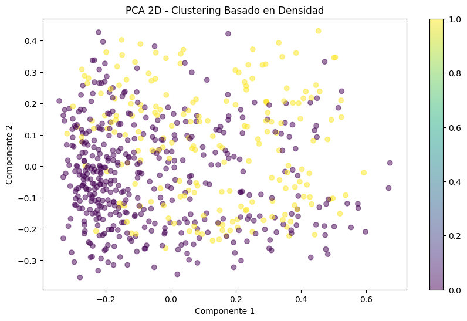
  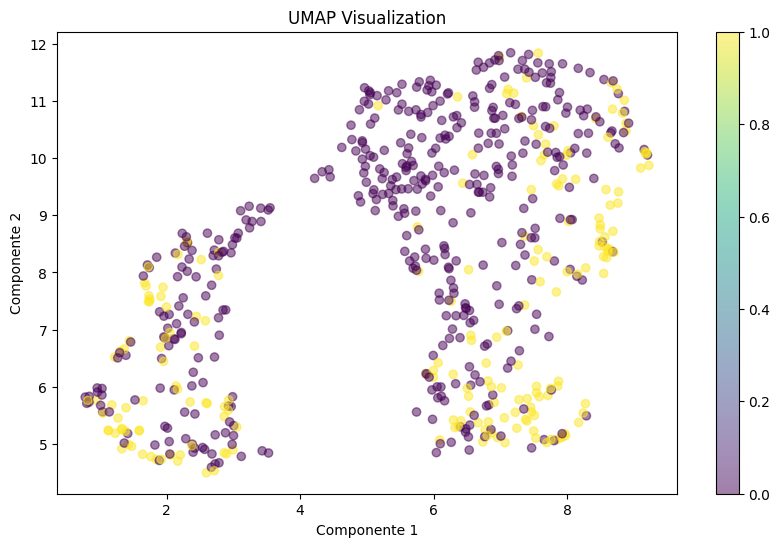
</p>

<p align="center">
  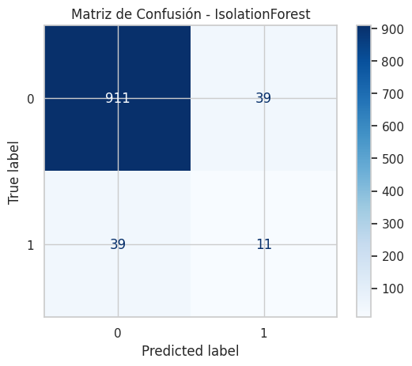
  
</p>

> **Interpretación:**  
> - **PCA/UMAP:** permiten observar agrupamientos naturales y posibles subpoblaciones.  
> - **Isolation Forest:** detecta los casos más extremos, con menos falsos positivos.  
> - **One-Class SVM:** identifica más anomalías, pero con menor especificidad.  
> - La combinación de **HDBSCAN + Isolation Forest** ofrece un equilibrio entre sensibilidad e interpretabilidad clínica.

---

#### 💬 Conclusión breve
El módulo demuestra cómo combinar **reducción de dimensionalidad**, **clustering basado en densidad** y **detección de anomalías** para descubrir perfiles atípicos de pacientes.  
La metodología es aplicable en contextos de salud para apoyar la **detección temprana de riesgos** y la **interpretación visual de patrones clínicos**.


---

### 8️⃣ API de Machine Learning Contenerizada (MLOps)

📁 `Modulo10MLMLOpsDocker/`

* **Objetivo:** construir una API REST reproducible para predicciones con modelo entrenado (*Breast Cancer Dataset*).
* **Stack:** Docker, Docker Compose, Flask, Gunicorn, Micromamba, Postman.
* **Servicios:**

  * `trainer`: entrena modelo y guarda artefactos en volumen persistente.
  * `api`: sirve predicciones en `/predict`.
* **Métricas del modelo:** Accuracy = 0.947 | F1 = 0.958.
* **Pruebas:** endpoints validados con Postman (`GET /`, `POST /predict`).

---

## 🧰 Tecnologías y Librerías Recurrentes

| Categoría          | Herramientas                                          |
| ------------------ | ----------------------------------------------------- |
| Lenguaje principal | Python 3.8–3.11                                       |
| Frameworks ML      | scikit-learn, TensorFlow, XGBoost                     |
| NLP                | spaCy, NLTK, TF-IDF, Word2Vec, FastText, Transformers |
| Interpretabilidad  | SHAP, LIME                                            |
| Optimización       | Optuna, RayTune, Hyperopt, Skopt                      |
| Visualización      | Matplotlib, Seaborn                                   |
| Contenerización    | Docker, Docker Compose, Micromamba                    |
| Ética y Fairness   | auditoría por grupo, SHAP fairness analysis           |

---

## 📊 Resultados Globales

| Área                        | Proyecto              | Métricas Destacadas                        |
| --------------------------- | --------------------- | ------------------------------------------ |
| **Regresión Lineal**        | GD vs SGD             | MSE bajo y convergencia estable            |
| **Optimización**            | Hyperparameter tuning | F1 ≈ 0.9 (sin CV) → F1 ≈ 0.8 (con CV)      |
| **Crédito (ML clásico)**    | LogReg / RF           | AUC 0.86                                   |
| **Crédito (Deep Learning)** | DNN / ResNet          | AUC 0.81 / 0.74                            |
| **Clustering / Anomalías**  | PCA + HDBSCAN         | Silhouette -0.09, ROC-AUC ≈ 0.64           |
| **NLP clínico**             | SVM + TF-IDF          | Accuracy > 0.80, fairness equilibrado      |
| **Interpretabilidad**       | SHAP / LIME           | Variables clave y sesgos éticos detectados |
| **MLOps**                   | API Flask Docker      | Accuracy 0.947, F1 0.958                   |

---


---

## 🧾 Autor y Portafolio Profesional

**Marco Antonio Parra Fernández **  
Especialista en Machine Learning – Talento Digital para Chile / Kibernum  
📍 Chile 🇨🇱  

🔗 [GitHub @maaferna](https://github.com/maaferna) · [LinkedIn](https://www.linkedin.com/in/maaferna)  
🌐 **Portafolio Web:** [https://portfolio-mparraf.herokuapp.com/](https://portfolio-mparraf.herokuapp.com/)

> Este portafolio integra los principales proyectos de la Especialidad Machine Learning, desplegados con **Django + Heroku**, con conexión a repositorios GitHub y almacenamiento cloud.  
> Presenta módulos de análisis, visualización y modelos productivos, reflejando el enfoque aplicado y profesional de la especialización.

---

## 📜 Licencia

Este repositorio y sus módulos están destinados a fines **académicos, formativos y de portafolio profesional**.  
Licencia de uso: [MIT License](https://opensource.org/licenses/MIT)  
© 2025 — **Marco Antonio Parra Fernández**. Todos los derechos reservados.

---
